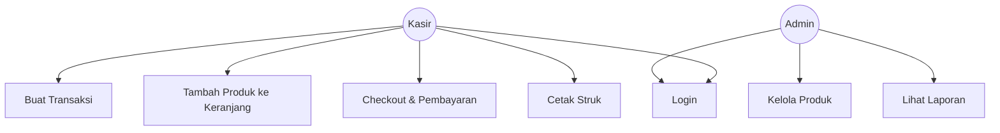
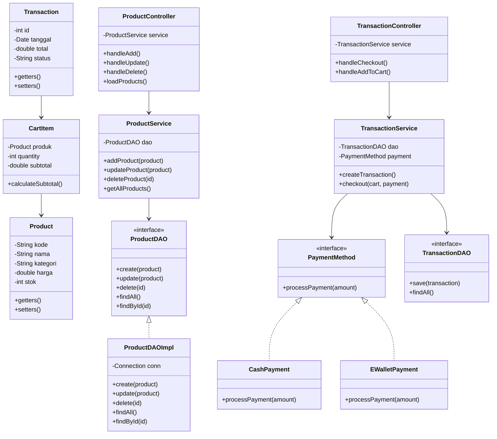
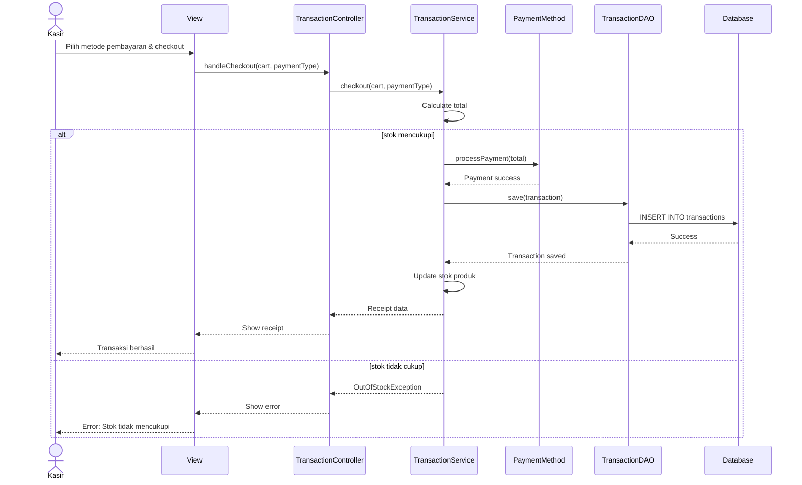

# Diagram UML dan Database - Agri-POS

Dokumen ini berisi diagram-diagram untuk sistem Agri-POS dalam format Mermaid.

---

## 1. Use Case Diagram



**Penjelasan:**
- **Kasir** dapat melakukan transaksi penjualan: membuat transaksi, menambah produk ke keranjang, checkout dengan pembayaran, dan mencetak struk.
- **Admin** dapat mengelola produk (CRUD), melihat laporan penjualan.
- Kedua role memerlukan login untuk mengakses sistem.

---

## 2. Class Diagram



**Penjelasan:**
- **Model Layer**: `Product`, `Transaction`, `CartItem` sebagai entitas domain.
- **DAO Layer**: Interface `ProductDAO` dan `TransactionDAO` dengan implementasi untuk akses database.
- **Service Layer**: `ProductService` dan `TransactionService` untuk logika bisnis.
- **Controller Layer**: `ProductController` dan `TransactionController` sebagai penghubung antara View dan Service.
- **Strategy Pattern**: `PaymentMethod` sebagai interface dengan implementasi `CashPayment` dan `EWalletPayment`.

---

## 3. Sequence Diagram - Tambah Produk

```mermaid
saaequenceDiagram
    actor Admin
    participant View
    participant Controller as ProductController
    participant Service as ProductService
    participant DAO as ProductDAO
    participant DB as Database
    
    Admin->>View: Input data produk
    View->>Controller: handleAdd(product)
    Controller->>Service: addProduct(product)
    Service->>Service: Validate product
    
    alt validation success
        Service->>DAO: create(product)
        DAO->>DB: INSERT INTO products
        DB-->>DAO: Success
        DAO-->>Service: Product saved
        Service-->>Controller: Success
        Controller-->>View: Show success message
        View-->>Admin: Produk berhasil ditambahkan
    else validation failed
        Service-->>Controller: ValidationException
        Controller-->>View: Show error message
        View-->>Admin: Error: Data tidak valid
    end
```

**Penjelasan:**
- Admin memasukkan data produk melalui form di View (JavaFX).
- Controller menerima input dan meneruskan ke Service.
- Service melakukan validasi (nama tidak kosong, harga > 0, dll).
- Jika valid, DAO melakukan INSERT ke database PostgreSQL.
- Jika tidak valid, sistem melempar `ValidationException` dan menampilkan pesan error.

---

## 4. Sequence Diagram - Checkout



**Penjelasan:**
- Kasir memilih metode pembayaran (Tunai atau E-Wallet) dan melakukan checkout.
- Service menghitung total dari semua item di keranjang.
- Sistem memeriksa ketersediaan stok untuk setiap produk.
- Jika stok mencukupi, proses pembayaran dilakukan melalui strategy pattern (`PaymentMethod`).
- Transaksi disimpan ke database dan stok produk diupdate.
- Struk ditampilkan kepada kasir.
- Jika stok tidak mencukupi, sistem melempar `OutOfStockException`.

---

## 5. Database Design

Lihat dokumentasi lengkap database design di:
👉 [praktikum/week15-proyek-kelompok/docs/03_database.md](../praktikum/week15-proyek-kelompok/docs/03_database.md)

Dokumentasi tersebut mencakup:
- **ERD (Mermaid)** - Entity Relationship Diagram dalam format Mermaid
- **SQL DDL Schema** - Skema lengkap semua tabel dengan constraints dan indexes
- **Sample Seed Data** - Data contoh untuk testing dan demo

---

## Catatan Implementasi

### Arsitektur Layer
Sistem mengikuti arsitektur berlapis (layered architecture):
1. **View Layer**: JavaFX (FXML + Controller)
2. **Controller Layer**: Menangani input dari View, memanggil Service
3. **Service Layer**: Logika bisnis, validasi, orchestration
4. **DAO Layer**: Akses data ke PostgreSQL menggunakan JDBC
5. **Database Layer**: PostgreSQL

### Design Patterns
1. **Strategy Pattern**: Untuk metode pembayaran (`PaymentMethod`, `CashPayment`, `EWalletPayment`)
2. **Singleton Pattern**: Untuk koneksi database
3. **DAO Pattern**: Untuk pemisahan logika akses data

### Exception Handling
- `ValidationException`: Untuk validasi input (nama kosong, harga negatif, dll)
- `OutOfStockException`: Untuk kondisi stok tidak mencukupi
- `DatabaseException`: Untuk error koneksi atau query database

---

## Referensi
- Dokumen lengkap: [15_bab15_proyek_kelompok.md](15_bab15_proyek_kelompok.md)
- Database Design Detail: [praktikum/week15-proyek-kelompok/docs/03_database.md](../praktikum/week15-proyek-kelompok/docs/03_database.md)
- Struktur kode: `praktikum/week15-proyek-kelompok/`
