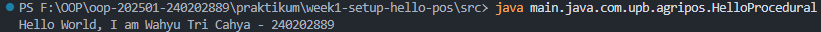
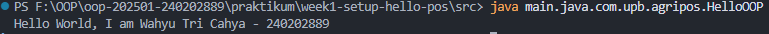
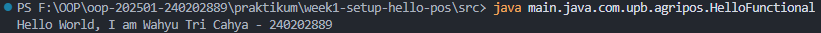

# Laporan Praktikum Minggu 1
Topik: "Pengenalan Paradigma dan Setup Proyek"

## Identitas
- Nama  : Wahyu Tri Cahya
- NIM   : 240202889
- Kelas : 3IKRB

---

## Tujuan
- Mahasiswa mampu mendefinisikan paradigma prosedural, OOP, dan fungsional.
- Mahasiswa mampu membandingkan kelebihan dan keterbatasan tiap paradigma.
- Mahasiswa mampu memberikan contoh program sederhana untuk masing-masing paradigma.
- Mahasiswa aktif dalam diskusi kelas (bertanya, menjawab, memberi opini).

---

## Dasar Teori
Paradigma pemrograman adalah cara pandang dalam menyusun program:  
- **Prosedural**: program dibangun sebagai rangkaian perintah (fungsi/prosedur).  
- **OOP (Object-Oriented Programming)**: program dibangun dari objek yang memiliki data (atribut) dan perilaku (method).  
- **Fungsional**: program dipandang sebagai pemetaan fungsi matematika, lebih menekankan ekspresi dan transformasi data. 

---

## Langkah Praktikum
1. Menginstall JDK versi terbaru dan cek instalasinya menggunakan perintah `java -version`  
2. Membuat file program `HelloProcedural.java`, `HelloOOP.java`, dan `HelloFunctional.java`.
3. Menulis kode sesuai paradigma yang diminta.
4. Melakukan eksekusi program
5. Mengecek hasil eksekusi di terminal.
6. Membuat commit ke repository GitHub dengan pesan commit `"week1-setup-hello-pos"`

---

## Kode Program
- Prosedural
```java
// HelloProcedural
public class HelloProcedural {
    public static void main(String[] args) {
        String nim = "240202889";
        String name = "Wahyu Tri Cahya";

        System.out.println("Hello World, I am " + name + " - " + nim);
    }
}
```

- OOP (Object-Oriented Programming)
```java
// HelloOOP
class Student {
    String nim;
    String name;
    Student(String nim, String name) {
        this.nim = nim;
        this.name = name;
    }

    void introduce() {
        System.out.println("Hello World, I am " + name + " - " + nim);
    }
}

public class HelloOOP {
    public static void main(String[] args) {
        Student s = new Student("240202889", "Wahyu Tri Cahya");
        s.introduce();
    }
}
```
- Fungsional
```java
// HelloFunctional
import java.util.function.BiConsumer;

public class HelloFunctional {
    public static void main(String[] args) {
        BiConsumer<String, String> introduce =
            (nim, name) -> System.out.println("Hello World, I am " + name + " - " + nim);

        introduce.accept("240202889", "Wahyu Tri Cahya");
    }
}
```

---

## Hasil Eksekusi
- HelloProcedural

- HelloOOP

- HelloFunctional


---

## Analisis
- Cara kerja kode:
   - Pada paradigma prosedural, kode hanya berupa urutan instruksi tanpa class.
   - Pada paradigma OOP, kode dibungkus dalam class Student sehingga data (nim, name) dan perilaku (introduce()) disatukan.
   - Pada paradigma fungsional, digunakan lambda expression dan functional interface (BiConsumer) untuk mencetak pesan.
   
- Perbedaan dengan minggu sebelumnya:
   - Minggu ini mulai diperkenalkan perbedaan paradigma, tidak hanya menulis instruksi sederhana.
   - Pendekatan OOP membuat program lebih terstruktur, sedangkan functional membuat kode lebih ringkas.
- Kendala:
   - Awalnya bingung membedakan kapan harus pakai class vs lambda.
   - Solusi: membaca dokumentasi Java tentang java.util.function dan contoh penggunaan OOP sederhana. 

---

## Kesimpulan
- Paradigma prosedural cocok untuk program sederhana dan cepat dibuat.
- Paradigma OOP memberikan struktur yang jelas dengan memanfaatkan class dan object, sehingga program lebih mudah dikembangkan.
- Paradigma fungsional membuat kode lebih ringkas dan mengurangi boilerplate dengan memanfaatkan lambda expression.
- Dengan memahami ketiga paradigma, mahasiswa dapat memilih pendekatan yang tepat sesuai kebutuhan aplikasi.

---

## Quiz
1. Apakah OOP selalu lebih baik dari prosedural?  
   **Jawaban:**
   Tidak selalu. OOP lebih baik ketika kita membutuhkan representasi dunia nyata dengan objek, enkapsulasi data, dan hubungan antar-entitas yang kompleks. Namun, untuk aplikasi kecil, sederhana, atau tugas sekali jalan (script), paradigma prosedural lebih cepat, ringan, dan mudah dipahami tanpa overhead membuat class dan objek.

2. Kapan functional programming lebih cocok digunakan dibanding OOP  atau prosedural?    
   **Jawaban:**
   Functional programming lebih cocok digunakan saat:
   - Kita bekerja dengan data yang harus diproses secara paralel/konkuren (karena fungsi murni lebih mudah diparalelkan).
   - Lingkungan membutuhkan reliabilitas tinggi dan minim bug (karena tidak ada *side effect*).
   - Kasus seperti data transformation (ETL), pemrosesan koleksi besar, AI/ML pipeline, atau sistem event-driven.
   - Kita ingin mengurangi kompleksitas logika dengan komposisi fungsi ketimbang hierarki kelas yang dalam.  

3. Bagaimana paradigma (prosedural, OOP, fungsional) memengaruhi maintainability dan scalability aplikasi?  
   **Jawaban:**
   - **Prosedural:** Mudah dipahami untuk program kecil, tapi sulit di-*maintain* ketika aplikasi membesar karena logika dan data sering bercampur. Skalabilitas rendah.  
   - **OOP:** Lebih maintainable untuk sistem besar karena ada struktur class, encapsulation, inheritance, dan polymorphism. Skalabilitas tinggi karena mudah menambah fitur dengan objek baru.  
   - **Functional:** Maintainability tinggi untuk logika kompleks, karena fungsi murni lebih mudah diuji dan dirangkai ulang. Skalabilitas baik di sistem berbasis data atau yang membutuhkan *concurrency*. 

4. Mengapa OOP lebih cocok untuk mengembangkan aplikasi POS dibanding prosedural?  
**Jawaban:**
   Karena aplikasi POS (Point of Sale) memiliki banyak entitas berbeda yang saling berhubungan seperti `Produk`, `Transaksi`, `Kasir`, `Pelanggan`, dan `Pembayaran`. Dengan OOP:
   - Data dan perilaku bisa disatukan dalam class (misalnya `Transaksi` punya method `hitungTotal()`).
   - Relasi antar-objek jelas (misalnya `Transaksi` berisi daftar `Produk`).
   - Kode lebih terstruktur, mudah dikembangkan, dan di-*maintain* seiring bertambahnya fitur.

5. Bagaimana paradigma fungsional dapat membantu mengurangi kode berulang (boilerplate code)?  
**Jawaban:**
   Paradigma fungsional mengurangi boilerplate dengan:
   - **Higher-order function** → kita bisa membuat fungsi umum (misalnya `map`, `filter`, `reduce`) yang bisa dipakai ulang untuk berbagai kebutuhan tanpa menulis loop berulang.  
   - **Immutability & pure function** → memisahkan logika dari state, sehingga fungsi bisa dipakai ulang tanpa bergantung pada konteks.  
   - **Function composition** → membangun fungsi kompleks dari fungsi kecil tanpa duplikasi kode.  