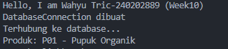
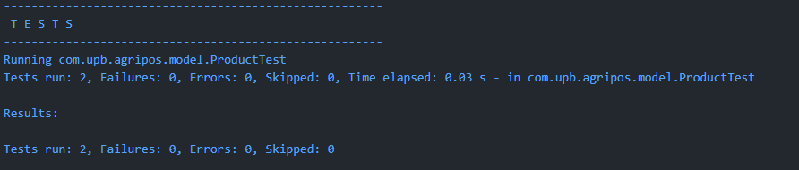

# Laporan Praktikum Minggu 10

Topik: Design Pattern (Singleton, MVC) dan Unit Testing menggunakan JUnit

## Identitas

* Nama  : Wahyu Tric
* NIM   : [NIM Mahasiswa]
* Kelas : [Kelas]

---

## Tujuan

Mahasiswa mampu memahami konsep design pattern, mengimplementasikan Singleton Pattern dan Model–View–Controller (MVC), serta membuat dan menjalankan unit testing menggunakan JUnit guna meningkatkan kualitas perangkat lunak.

---

## Dasar Teori

1. Design pattern adalah solusi desain yang telah teruji untuk menyelesaikan permasalahan umum dalam pengembangan perangkat lunak.
2. Singleton Pattern digunakan untuk memastikan sebuah class hanya memiliki satu instance.
3. Model–View–Controller (MVC) memisahkan logika bisnis, tampilan, dan pengontrol aplikasi.
4. Unit testing bertujuan untuk menguji bagian kecil dari program secara terpisah.
5. JUnit merupakan framework pengujian yang umum digunakan pada bahasa pemrograman Java.

---

## Langkah Praktikum

1. Membuat struktur project Java sesuai panduan praktikum Week 10.
2. Mengimplementasikan Singleton Pattern pada class `DatabaseConnection`.
3. Menerapkan konsep MVC pada fitur Product yang terdiri dari Model, View, dan Controller.
4. Membuat unit test menggunakan JUnit untuk menguji class Product.
5. Menjalankan unit test dan mendokumentasikan hasil pengujian.
6. Melakukan commit dengan pesan:

   `week10-pattern-testing: implement singleton, mvc, and junit test`

---

## Kode Program

Contoh kode utama yang dibuat:

```java
// Singleton test
DatabaseConnection db1 = DatabaseConnection.getInstance();
db1.connect();

// MVC
Product product = new Product("P01", "Pupuk Organik");
ConsoleView view = new ConsoleView();
ProductController controller = new ProductController(product, view);
```

Contoh kode unit testing:

```java
@Test
public void testProductName() {
    Product product = new Product("P01", "Benih Jagung");
    assertEquals("Benih Jagung", product.getName());
}

@Test
public void testProductCode() {
    Product product = new Product("P02", "Pupuk Cair");
    assertEquals("P02", product.getCode());
}
```

---

## Hasil Eksekusi

Program berhasil menampilkan data produk pada console dan seluruh unit test berjalan tanpa error.



---

## Analisis

* Singleton memastikan objek `DatabaseConnection` hanya dibuat satu kali.
* MVC memisahkan tanggung jawab antara Model, View, dan Controller sehingga kode lebih rapi.
* Dibandingkan praktikum sebelumnya, pendekatan ini membuat aplikasi lebih terstruktur dan mudah diuji.
* Kendala utama adalah konfigurasi JUnit, yang dapat diatasi dengan memastikan dependensi dan package sudah benar.

---

## Kesimpulan

Penerapan Singleton Pattern, MVC, dan unit testing menggunakan JUnit membuat aplikasi lebih terstruktur, mudah dikembangkan, dan memiliki kualitas perangkat lunak yang lebih baik.

---

## Quiz

1. Mengapa constructor pada Singleton harus bersifat private?
   **Jawaban:** Agar objek tidak dapat dibuat langsung dari luar class dan instance hanya bisa diakses melalui method `getInstance()`.

2. Jelaskan manfaat pemisahan Model, View, dan Controller.
   **Jawaban:** Memudahkan pemeliharaan kode, meningkatkan keterbacaan, dan memungkinkan perubahan pada satu bagian tanpa memengaruhi bagian lain.

3. Apa peran unit testing dalam menjaga kualitas perangkat lunak?
   **Jawaban:** Unit testing membantu mendeteksi kesalahan sejak dini dan memastikan setiap fungsi berjalan sesuai harapan.

4. Apa risiko jika Singleton tidak diimplementasikan dengan benar?
   **Jawaban:** Dapat menyebabkan lebih dari satu instance dibuat sehingga terjadi pemborosan resource dan inkonsistensi data.
