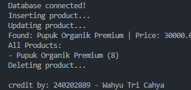

# Laporan Praktikum Minggu 11
Topik: Data Access Object (DAO) dan CRUD Database dengan JDBC

## Identitas
- Nama  : Wahyu Tri Cahya
- NIM   : 240202889
- Kelas : 3IKRB

---

## Tujuan
1. Menjelaskan konsep Data Access Object (DAO) dalam pengembangan aplikasi OOP.
2. Menghubungkan aplikasi Java dengan basis data menggunakan JDBC.
3. Mengimplementasikan operasi CRUD (Create, Read, Update, Delete) secara lengkap.
4. Mengintegrasikan DAO dengan class aplikasi OOP sesuai prinsip desain yang baik.

---

## Dasar Teori
1. **Data Access Object (DAO)**: Pola desain yang memisahkan logika akses data dari logika bisnis aplikasi. Ini membuat kode lebih terstruktur dan memudahkan penggantian teknologi database tanpa mengubah logika utama.
2. **JDBC (Java Database Connectivity)**: Standar API Java untuk menghubungkan aplikasi dengan basis data relasional. Komponen utamanya meliputi `DriverManager` (mengelola driver), `Connection` (sesi koneksi), `PreparedStatement` (eksekusi query aman), dan `ResultSet` (menampung hasil query).
3. **PreparedStatement**: Interface JDBC yang digunakan untuk mengeksekusi statement SQL yang telah dikompilasi sebelumnya. Ini lebih efisien dan aman dari serangan SQL Injection dibandingkan `Statement` biasa.

---

## Langkah Praktikum
1. **Persiapan Database**: Membuat database `agripos` dan tabel `products` di PostgreSQL.
2. **Membuat Model**: Membuat class `Product.java` sebagai representasi objek data.
3. **Membuat Interface DAO**: Mendefinisikan kontrak operasi CRUD di `ProductDAO.java`.
4. **Implementasi DAO**: Mengimplementasikan logika database JDBC di `ProductDAOImpl.java` menggunakan `PreparedStatement`.
5. **Integrasi & Pengujian**: Membuat class `MainDAOTest.java` untuk menjalankan skenario CRUD (Insert -> Update -> Read -> Delete) dan memverifikasi hasilnya.
6. Melakukan commit dengan pesan:

   `week11-dao-database: week11-dao-database: fitur implementasi DAO dan CRUD database`
---

## Kode Program

**1. ProductDAOImpl.java (Implementasi CRUD)**
```java
@Override
public void insert(Product p) {
    String sql = "INSERT INTO products (code, name, price, stock) VALUES (?, ?, ?, ?)";
    try (PreparedStatement stmt = connection.prepareStatement(sql)) {
        stmt.setString(1, p.getCode());
        stmt.setString(2, p.getName());
        stmt.setDouble(3, p.getPrice());
        stmt.setInt(4, p.getStock());
        stmt.executeUpdate();
    } catch (SQLException e) {
        e.printStackTrace();
    }
}
```

---

## Hasil Eksekusi  


---

## Analisis
Pada praktikum ini, implementasi pola desain **Data Access Object (DAO)** dilakukan untuk memisahkan logika bisnis dari logika akses data.
1.  **Alur Program**:
    - Program dimulai dengan membuat koneksi ke database PostgreSQL menggunakan `DriverManager`.
    - Objek `ProductDAOImpl` diinstansiasi dengan koneksi tersebut.
    - `MainDAOTest` melakukan operasi CRUD: menambah produk (`insert`), memperbarui data (`update`), mengambil data (`findByCode` dan `findAll`), dan menghapus data (`delete`).
    - Setiap operasi database dibungkus dalam blok `try-catch` untuk menangani `SQLException`.

2.  **Perbedaan dengan Minggu Sebelumnya**:
    - Minggu sebelumnya penyimpanan data bersifat *volatile* (hilang saat program berhenti) karena hanya menggunakan `ArrayList` di memori.
    - Minggu ini data bersifat *persistent* (tetap ada meski program berhenti) karena disimpan di database PostgreSQL.
    - Penggunaan JDBC memperkenalkan penanganan *checked exception* (`SQLException`) yang lebih intensif.

3.  **Kendala dan Solusi**:
    - **Kendala**: Kesalahan *Duplicate Key* saat menjalankan program berulang kali karena data dengan Primary Key yang sama sudah ada.
    - **Solusi**: Menambahkan perintah `dao.delete("P01")` di awal program untuk membersihkan data lama sebelum insert baru.

---

## Kesimpulan
Penerapan DAO dengan JDBC memberikan struktur yang jelas dalam aplikasi Java yang berinteraksi dengan database. Pola ini meningkatkan **modularitas** (pemisahan tanggung jawab), **keamanan** (lewat `PreparedStatement`), dan **kemudahan pemeliharaan**. Data kini dapat disimpan secara permanen, menjadikan aplikasi lebih realistis dibandingkan sekadar menggunakan variabel memori.

---

## Quiz
1. **Apa kegunaan utama dari pola desain DAO?**
   **Jawaban:** Untuk memisahkan logika akses data (query SQL, koneksi database) dari logika bisnis aplikasi, sehingga kode lebih rapi dan mudah dirawat.

2. **Mengapa disarankan menggunakan `PreparedStatement` daripada `Statement`?**
   **Jawaban:** `PreparedStatement` lebih aman karena mencegah serangan *SQL Injection* melalui parameter binding, dan lebih cepat karena query dikompilasi sebelumnya (pre-compiled) oleh database.

3. **Apa fungsi method `executeUpdate()` dan `executeQuery()`?**
   **Jawaban:** `executeUpdate()` digunakan untuk perintah DML (INSERT, UPDATE, DELETE) yang mengubah data dan mengembalikan jumlah baris yang terpengaruh, sedangkan `executeQuery()` digunakan untuk perintah SELECT yang mengembalikan hasil data dalam bentuk `ResultSet`.
