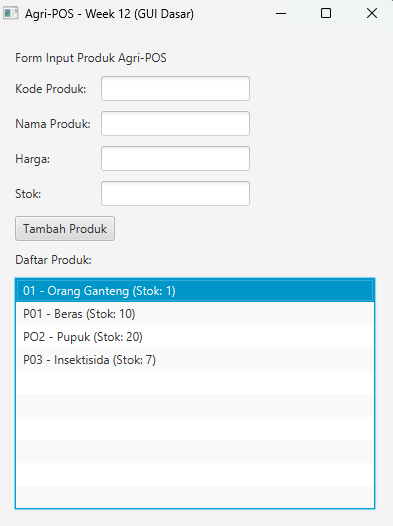

# Laporan Praktikum Minggu 12
Topik: GUI Dasar JavaFX (Event-Driven Programming)

## Identitas
- Nama  : Wahyu Tri Cahya
- NIM   : 240202889
- Kelas : 3IKRB

---

## Tujuan
1. Menjelaskan konsep event-driven programming.
2. Membangun antarmuka grafis sederhana menggunakan JavaFX.
3. Membuat form input data produk.
4. Menampilkan daftar produk pada GUI.
5. Mengintegrasikan GUI dengan modul backend yang telah dibuat (DAO & Service).

---

## Dasar Teori
1. **Event-Driven Programming**: Paradigma pemrograman di mana alur eksekusi program ditentukan oleh kejadian (event) seperti klik mouse, penekanan tombol keyboard, atau input pengguna lainnya.
2. **JavaFX**: Platform perangkat lunak untuk membuat dan mengirimkan aplikasi desktop serta aplikasi internet kaya (RIA) yang dapat berjalan di berbagai perangkat.
3. **MVC (Model-View-Controller)**: Pola desain arsitektur yang memisahkan aplikasi menjadi tiga komponen utama: Model (data), View (tampilan), dan Controller (logika penghubung), untuk memudahkan pengelolaan dan pengembangan.
4. **Dependency Injection**: Teknik di mana ketergantungan objek (seperti Service atau DAO) disuntikkan ke dalam objek yang membutuhkannya, bukan dibuat di dalamnya, untuk meningkatkan fleksibilitas dan pengujian.

---

## Langkah Praktikum
1. **Setup Project**: Memastikan library JavaFX terkonfigurasi dengan benar pada project.
2. **Membuat Layout GUI**: Membuat class `ProductFormView` yang berisi komponen `TextField` untuk input (Kode, Nama, Harga, Stok), `Button` untuk aksi tambah, dan `ListView` untuk menampilkan data.
3. **Implementasi Controller**: Membuat `ProductController` yang menangani logika saat tombol ditekan.
4. **Integrasi Backend**: Menghubungkan Controller dengan `ProductService` untuk menyimpan data ke database melalui DAO.
5. **Event Handling**: Menambahkan event listener pada tombol "Tambah Produk" untuk memicu proses penyimpanan dan pembaruan tampilan.
6. **Commit dan Push**: Menyimpan perubahan ke repository dengan pesan `week12-gui-dasar: implement basic javafx gui for product entry`.

---

## Kode Program
Berikut adalah potongan kode implementasi event handler pada tombol tambah produk:

```java
// Contoh implementasi pada Controller / View
btnAdd.setOnAction(event -> {
    try {
        // Mengambil data dari form
        Product p = new Product(
             txtCode.getText(),
             txtName.getText(),
             Double.parseDouble(txtPrice.getText()),
             Integer.parseInt(txtStock.getText())
        );
        
        // Memanggil service untuk menyimpan ke database (Backend Integration)
        productService.insert(p); 
        
        // Update tampilan ListView
        listView.getItems().add(p.getCode() + " - " + p.getName());
        
        // Reset form
        clearFields();
    } catch (NumberFormatException e) {
        showAlert("Input Error", "Harga dan Stok harus berupa angka.");
    } catch (Exception e) {
        showAlert("Error", "Gagal menyimpan produk: " + e.getMessage());
    }
});
```

---

## Hasil Eksekusi
Tampilan GUI Form Produk yang telah berjalan:



---

## Analisis
- **Event-Driven**: Aplikasi tidak berjalan secara linear dari atas ke bawah, melainkan menunggu aksi pengguna (klik tombol) untuk menjalankan logika penyimpanan data.
- **Integrasi Backend**: GUI berhasil terhubung dengan `ProductService` dan `ProductDAO` yang dibuat pada pertemuan sebelumnya. Hal ini menunjukkan penerapan prinsip *Reusability*, di mana logika bisnis backend tidak perlu ditulis ulang untuk antarmuka yang berbeda.
- **Validasi Input**: Diperlukan penanganan error (try-catch) saat parsing data angka (harga/stok) dari TextField untuk mencegah aplikasi crash jika input tidak valid.
- **Kendala**: Tantangan utama adalah mengatur layout JavaFX agar rapi dan menangani thread UI saat melakukan operasi database.

---

## Kesimpulan
Praktikum ini berhasil mendemonstrasikan pembuatan aplikasi GUI sederhana menggunakan JavaFX yang terintegrasi dengan backend yang sudah ada. Penggunaan pola MVC dan Event-Driven Programming membuat struktur kode tetap rapi dan terpisah antara logika tampilan dan logika bisnis.

---

## Traceability Bab 6 (UML) -> GUI

| Artefak Bab 6 | Referensi | Handler GUI | Controller/Service | DAO | Dampak UI/DB |
|---|---|---|---|---|---|
| Use Case | UC-01 Tambah Produk | Tombol Tambah | `ProductController.add()` → `ProductService.insert()` | `ProductDAO.insert()` | UI list bertambah + DB insert |
| Activity | AD-01 Tambah Produk | Tombol Tambah | Validasi input & panggil service | `insert()` | validasi → simpan → tampil |
| Sequence | SD-01 Tambah Produk | Tombol Tambah | View→Controller→Service | DAO→DB | urutan panggilan sesuai SD |
