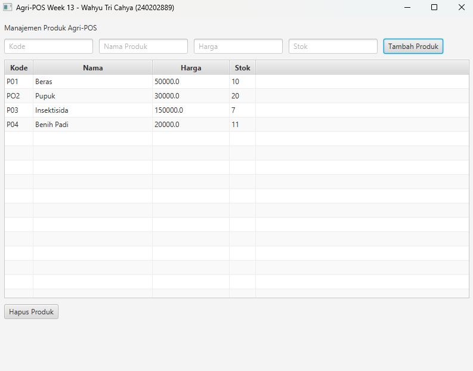

# Laporan Praktikum Minggu 13
Topik: GUI Lanjutan JavaFX (TableView dan Lambda Expression)

## Identitas
- Nama  : Wahyu Tri Cahya
- NIM   : 240202889
- Kelas : 3IKRB

---

## Tujuan
1. Menampilkan data menggunakan TableView JavaFX.
2. Mengintegrasikan koleksi objek dengan GUI.
3. Menggunakan lambda expression untuk event handling.
4. Menghubungkan GUI dengan DAO secara penuh.
5. Membangun antarmuka GUI Agri-POS yang lebih interaktif.

---

## Langkah Praktikum
1. **Setup Project**: Membuat file `pom.xml` untuk dependensi JavaFX dan PostgreSQL.
2. **Implementasi Backend**: Membuat `ProductDAO`, `ProductDAOImpl`, dan `ProductService` untuk menangani akses database.
3. **Implementasi View**: Membuat `ProductTableView` yang berisi tabel produk dan form input.
4. **Implementasi Controller**: Membuat `ProductController` yang menghubungkan View dan Service, serta menangani event tombol menggunakan Lambda Expression.
5. **Integrasi**: Menghubungkan semua komponen di `AppJavaFX`.
6. **Commit dan Push**: Menyimpan perubahan ke repository dengan pesan `week13-gui-lanjutan: implement gui with tableview and lambda expression`.

---

## Kode Program
Berikut adalah implementasi Lambda Expression pada Controller untuk menghapus produk:

```java
// Event Handler: Hapus Produk (Lambda)
view.getBtnDelete().setOnAction(e -> {
    Product selected = view.getTable().getSelectionModel().getSelectedItem();
    if (selected != null) {
        try {
            service.deleteProduct(selected.getCode());
            loadData(); // Reload TableView
        } catch (Exception ex) {
            showAlert("Error", "Gagal menghapus: " + ex.getMessage());
        }
    } else {
        showAlert("Warning", "Pilih produk yang akan dihapus.");
    }
});
```

---

## Hasil Eksekusi
Tampilan GUI dengan TableView yang menampilkan data dari database:



---

## Analisis
- **TableView**: Penggunaan `TableView` memudahkan menampilkan data tabular yang kompleks dibandingkan `ListView`. Binding data dilakukan menggunakan `PropertyValueFactory` yang mencocokkan nama field di class `Product`.
- **Lambda Expression**: Kode event handling menjadi lebih ringkas dan mudah dibaca dibandingkan menggunakan anonymous inner class.
- **Integrasi Database**: Data yang tampil di tabel bersifat dinamis dan real-time dari database PostgreSQL. Setiap penambahan atau penghapusan langsung merefleksikan perubahan di database.

---

## Traceability Bab 6 (UML) -> GUI

| Artefak Bab 6 | Referensi | Handler GUI | Controller/Service | DAO | Dampak UI/DB |
|---|---|---|---|---|---|
| Use Case | UC-02 Lihat Daftar Produk | `loadData()` / init view | `ProductController.load()` → `ProductService.findAll()` | `ProductDAO.findAll()` | TableView terisi dari DB |
| Use Case | UC-03 Hapus Produk | Tombol Hapus | `ProductController.delete()` → `ProductService.delete(code)` | `ProductDAO.delete(code)` | DB delete + TableView reload |
| Sequence | SD-02 Hapus Produk | Tombol Hapus | View→Controller→Service | DAO→DB | urutan panggilan sesuai SD |