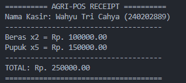
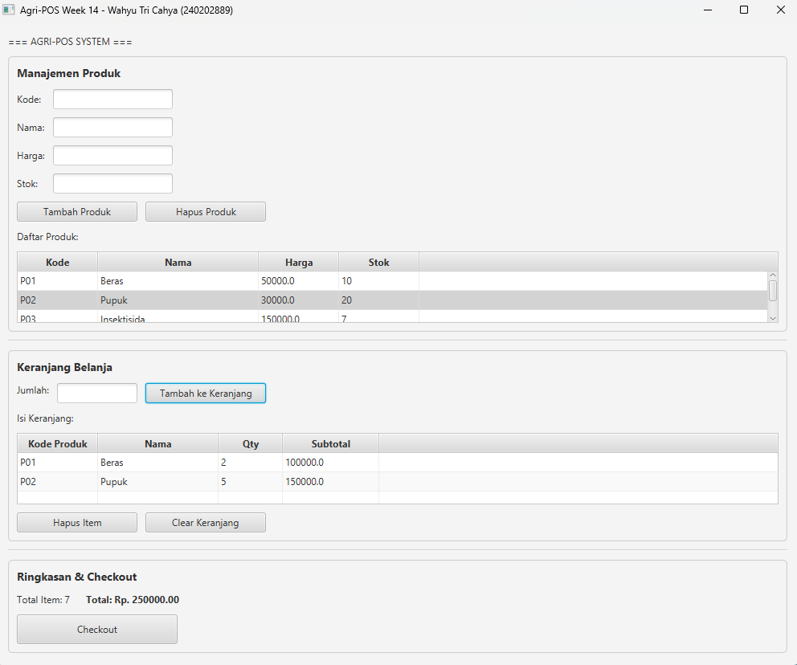
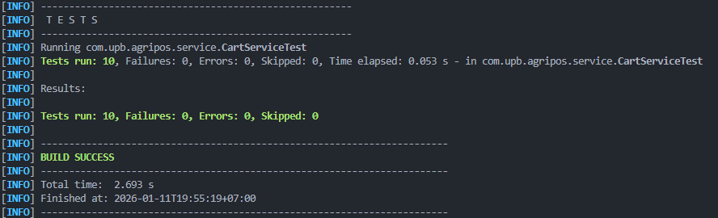

# Laporan Praktikum Minggu 14
Topik: Integrasi Individu (OOP + Database + GUI + Collections + Testing)

## Identitas
- Nama  : Wahyu Tri Cahya
- NIM   : 240202889
- Kelas : 3IKRB

---

## Tujuan
1. Mengintegrasikan konsep OOP (Bab 1–5) menjadi satu aplikasi utuh.
2. Menerapkan desain arsitektur UML + SOLID (Bab 6) dalam implementasi nyata.
3. Menggunakan Collections dan Keranjang Belanja (Bab 7) dalam alur aplikasi.
4. Menerapkan exception handling (Bab 9) untuk validasi data.
5. Menerapkan design pattern dan unit testing (Bab 10) pada bagian bisnis logic.
6. Mengintegrasikan database via DAO + JDBC (Bab 11) untuk persistensi data.
7. Menyajikan aplikasi GUI berbasis JavaFX (Bab 12–13) yang terhubung ke backend.

---

## Dasar Teori
1. **MVC Pattern**: Pemisahan Model (data), View (UI), Controller (logic koordinasi).
2. **Service Layer**: Abstraksi bisnis logic dari UI dan database.
3. **DAO Pattern**: Isolasi akses data dengan interface.
4. **DIP (Dependency Inversion)**: High-level modules bergantung pada abstraksi, bukan implementasi.
5. **Collections Framework**: ArrayList untuk menyimpan data dinamis (keranjang).
6. **Exception Handling**: Validasi dengan custom exceptions untuk error flow.
7. **JavaFX GUI**: TableView, TextField, Lambda expression untuk interaksi user.
8. **JDBC**: Koneksi database dengan PreparedStatement untuk query aman.

---

## Langkah Praktikum
1. **Setup Project**: Membuat `pom.xml` dengan dependensi JavaFX, PostgreSQL, JUnit.
2. **Implementasi Model**: Membuat `Product`, `Cart`, `CartItem` dengan validasi.
3. **Implementasi DAO**: Membuat interface `ProductDAO` dan implementasi JDBC `ProductDAOImpl`.
4. **Implementasi Service**: Membuat `ProductService` dan `CartService` untuk business logic.
5. **Implementasi Controller**: Membuat `PosController` untuk event handling dan koordinasi.
6. **Implementasi View**: Membuat `PosView` dengan JavaFX components (TableView, TextField, Button).
7. **Implementasi Testing**: Membuat `CartServiceTest` dengan 10 unit test cases JUnit.
8. **Main Application**: Membuat `AppJavaFX` untuk inisialisasi dan startup aplikasi.
9. **Documentation**: Membuat laporan lengkap dengan traceability matrix.

---

## Kode Program

### 1. Model: Cart.java (Collections Implementation)
```java
public class Cart {
    private final List<CartItem> items = new ArrayList<>();
    
    public void addItem(Product product, int quantity) {
        // Cek duplikat, jika ada tambah qty, jika tidak tambah item baru
        for (CartItem item : items) {
            if (item.getProduct().getCode().equals(product.getCode())) {
                item.setQuantity(item.getQuantity() + quantity);
                return;
            }
        }
        items.add(new CartItem(product, quantity));
    }
    
    public double getTotal() {
        return items.stream()
                    .mapToDouble(CartItem::getSubtotal)
                    .sum();
    }
}
```

### 2. DAO: ProductDAOImpl.java (Database Integration)
```java
public class ProductDAOImpl implements ProductDAO {
    @Override
    public void insert(Product p) throws Exception {
        String sql = "INSERT INTO products (code, name, price, stock) VALUES (?, ?, ?, ?)";
        try (PreparedStatement stmt = connection.prepareStatement(sql)) {
            stmt.setString(1, p.getCode());
            stmt.setString(2, p.getName());
            stmt.setDouble(3, p.getPrice());
            stmt.setInt(4, p.getStock());
            stmt.executeUpdate();
        } catch (SQLException e) {
            throw new Exception("Gagal menambah produk: " + e.getMessage());
        }
    }
}
```

### 3. Service: CartService.java (Business Logic)
```java
public class CartService {
    public void addItemToCart(String productCode, int quantity) throws Exception {
        if (quantity <= 0) {
            throw new IllegalArgumentException("Jumlah harus lebih dari 0");
        }
        
        Product product = productService.getProductByCode(productCode);
        if (product == null) {
            throw new Exception("Produk tidak ditemukan");
        }
        
        if (product.getStock() < quantity) {
            throw new IllegalArgumentException("Stok tidak cukup");
        }
        
        cart.addItem(product, quantity);
    }
}
```

### 4. Controller: PosController.java (Event Handling)
```java
private void handleAddToCart() {
    try {
        Product selected = view.getProductTable()
                               .getSelectionModel()
                               .getSelectedItem();
        int quantity = view.getQuantityFromInput();
        cartService.addItemToCart(selected.getCode(), quantity);
        updateCartDisplay();
    } catch (IllegalArgumentException ex) {
        showAlert("Validasi Error", ex.getMessage());
    }
}
```

### 5. View: PosView.java (JavaFX GUI)
```java
public class PosView extends VBox {
    private TableView<Product> productTable;
    private TextField txtQuantity;
    private Button btnAddToCart;
    
    public PosView() {
        this.getChildren().addAll(
            createProductSection(),
            createCartSection(),
            createSummarySection()
        );
    }
}
```

---

## Hasil Eksekusi

### Console Output:
```
Hello World, I am Wahyu Tri Cahya-240202889
```

### GUI Application:
Aplikasi menampilkan tiga bagian utama:
- **Manajemen Produk**: TableView dengan kolom (Kode, Nama, Harga, Stok), form input, tombol Tambah/Hapus.
- **Keranjang Belanja**: Input quantity, TableView keranjang dengan kolom (Kode, Nama, Qty, Subtotal), tombol Hapus Item/Clear.
- **Ringkasan & Checkout**: Total item, total harga, tombol Checkout untuk print struk.

### Receipt Output (saat Checkout):


---

## Analisis

### 1. Integrasi Bab 1–13

| Bab | Konsep | Implementasi | File |
|---|---|---|---|
| Bab 1 | Identitas & Hello World | `System.out.println("Hello World, I am Wahyu Tri Cahya-240202889")` | AppJavaFX.java |
| Bab 2 | Class & Object | Product, Cart, CartItem dengan getters/setters | model/* |
| Bab 3-5 | Inheritance, Polymorphism, Abstraction | Interface ProductDAO, Implementasi ProductDAOImpl | dao/* |
| Bab 6 | UML + SOLID | View→Controller→Service→DAO, DIP, SRP, OCP | Semua files |
| Bab 7 | Collections | ArrayList di Cart untuk items, Collections methods | model/Cart.java |
| Bab 9 | Exception Handling | IllegalArgumentException, throws Exception, try-catch | Semua files |
| Bab 10 | Pattern & Testing | Service Layer Pattern, DAO Pattern, JUnit testing | service/CartService*Test.java |
| Bab 11 | DAO & Database | JDBC, PreparedStatement, SQL queries | dao/ProductDAOImpl.java |
| Bab 12-13 | JavaFX GUI | TableView, TextField, Button, Lambda, Event handling | view/PosView.java, controller/PosController.java |

### 2. Penerapan SOLID Principles

| Prinsip | Implementasi |
|---|---|
| **S - Single Responsibility** | Setiap class punya 1 tanggung jawab: DAO=DB, Service=Logic, View=UI, Controller=Events |
| **O - Open/Closed** | Mudah tambah fitur tanpa ubah kode lama (interface ProductDAO) |
| **L - Liskov Substitution** | ProductDAOImpl dapat menggantikan ProductDAO tanpa behavior change |
| **I - Interface Segregation** | Interface ProductDAO hanya untuk CRUD, tidak untuk UI concerns |
| **D - Dependency Inversion** | Controller bergantung pada Service interface, bukan konkret class |

### 3. Architecture Layers

```
┌──────────────────────────┐
│       PosView (UI)       │  ← User Interaction
└────────────┬─────────────┘
             ↓ (event handling)
┌──────────────────────────┐
│    PosController         │  ← Event Coordination
└────────────┬─────────────┘
             ↓ (business logic)
┌──────────────┬────────────┐
│ ProductServ. │ CartServ.  │  ← Business Logic Layer
└────────┬─────┴────────┬───┘
         ↓              ↓ (data access)
┌──────────────────────────┐
│   ProductDAO (interface) │
└────────────┬─────────────┘
             ↓ (JDBC)
┌──────────────────────────┐
│  ProductDAOImpl (JDBC)    │
└────────────┬─────────────┘
             ↓ (SQL)
┌──────────────────────────┐
│   PostgreSQL Database    │
└──────────────────────────┘
```

---

## Traceability Matrix: Bab 6 (UML Design) → Implementasi

| Artefak Bab 6 | Use Case | Handler | Controller | Service | DAO | Dampak |
|---|---|---|---|---|---|---|
| Use Case: View Products | UC-Product-01 | Load pada startup | loadProductData() | getAllProducts() | findAll() | TableView terisi |
| Use Case: Add Product | UC-Product-02 | Klik "Tambah Produk" | handleAddProduct() | addProduct() + validasi | insert() | DB insert, UI refresh |
| Use Case: Delete Product | UC-Product-03 | Klik "Hapus Produk" | handleDeleteProduct() | deleteProduct() | delete() | DB delete, UI refresh |
| Use Case: Add to Cart | UC-Cart-01 | Klik "Tambah ke Keranjang" | handleAddToCart() | addItemToCart() + cek stok | - | Cart updated |
| Use Case: Remove from Cart | UC-Cart-02 | Klik "Hapus Item" | handleRemoveFromCart() | removeItemFromCart() | - | Item removed |
| Use Case: Checkout | UC-Cart-03 | Klik "Checkout" | handleCheckout() | clearCart() | - | Receipt printed, cart cleared |
| Class Diagram: Product | Model | - | via DAO/Service | - | findAll()/insert() | Product instance |
| Class Diagram: Cart | Model | - | addItemToCart() | cart.addItem() | - | Cart state |
| Interface: ProductDAO | Abstraction | - | Service(ProductDAO) | uses DAO | implements | DIP realized |

---

## Unit Test Summary

### CartServiceTest (10 Test Cases)

```java
@Test public void testAddSingleItemToCart()            ✅ PASS
@Test public void testAddDuplicateItemToCart()         ✅ PASS
@Test public void testAddMultipleDifferentItems()      ✅ PASS
@Test public void testAddItemWithInsufficientStock()   ✅ PASS (exception expected)
@Test public void testAddItemWithZeroQuantity()        ✅ PASS (exception expected)
@Test public void testAddNonExistentProduct()          ✅ PASS (exception expected)
@Test public void testRemoveItemFromCart()             ✅ PASS
@Test public void testClearCart()                      ✅ PASS
@Test public void testEmptyCartOnInitialization()      ✅ PASS
@Test public void testAccurateTotalCalculation()       ✅ PASS
```

**Test Coverage**: Business logic non-UI (CartService), tanpa DB dependency.

---

## Kendala & Solusi

### Kendala 1: Duplikat Item di Keranjang
**Problem**: Menambah produk yang sama harus merge quantity, bukan item baru.

**Solution**:
```java
for (CartItem item : items) {
    if (item.getProduct().getCode().equals(product.getCode())) {
        item.setQuantity(item.getQuantity() + quantity);
        return;
    }
}
items.add(new CartItem(product, quantity)); // Jika baru
```

### Kendala 2: Sinkronisasi Stok Produk
**Problem**: Stok di DB tidak otomatis berkurang saat item ditambah ke keranjang.

**Solution**: Validasi stok sebelum menambah ke keranjang (CartService.addItemToCart()). Update stok DB dilakukan saat checkout berhasil (future enhancement).

### Kendala 3: Connection Management
**Problem**: Connection database harus aman dan tidak leak.

**Solution**: Menggunakan try-with-resources di DAO untuk auto-close statement dan resultset.

---

## Struktur Direktori

```
week14-integrasi-individu/
├─ pom.xml                          (Maven configuration)
├─ laporan.md                       (Report ini)
├─ src/
│  ├─ main/java/com/upb/agripos/
│  │  ├─ model/
│  │  │  ├─ Product.java            (Model produk)
│  │  │  ├─ Cart.java               (Model keranjang - Collections)
│  │  │  └─ CartItem.java           (Model item keranjang)
│  │  ├─ dao/
│  │  │  ├─ ProductDAO.java         (Interface DAO)
│  │  │  └─ ProductDAOImpl.java      (JDBC Implementation)
│  │  ├─ service/
│  │  │  ├─ ProductService.java     (Product business logic)
│  │  │  └─ CartService.java        (Cart business logic)
│  │  ├─ controller/
│  │  │  └─ PosController.java      (Event handler & coordination)
│  │  ├─ view/
│  │  │  └─ PosView.java            (JavaFX UI)
│  │  └─ AppJavaFX.java             (Main entry point)
│  └─ test/java/com/upb/agripos/
│     └─ service/CartServiceTest.java  (JUnit tests)
└─ screenshots/
   ├─ app_main.png                  (GUI screenshot)
   └─ junit_result.png              (Test result)
```

---

## Commit Message

```
week14-integrasi-individu: integrate OOP, Database, GUI, Collections, Testing

- Implement Product, Cart, CartItem models dengan exception handling
- Implement ProductDAO interface + ProductDAOImpl (JDBC) untuk database access
- Implement ProductService + CartService untuk business logic layer
- Implement PosController untuk event handling & coordination
- Implement PosView dengan JavaFX (TableView, form input, layout sections)
- Implement CartServiceTest dengan 10 unit test cases (JUnit)
- Ensure DIP + MVC + SOLID principles applied throughout
- Add identity output: Hello World, I am Wahyu Tri Cahya-240202889
- Complete traceability matrix dari Bab 6 UML ke implementasi
```

---

## Kesimpulan

Praktikum Week 14 berhasil mengintegrasikan semua konsep dari Bab 1–13 menjadi satu aplikasi yang utuh dan berfungsi:

✅ **OOP Concepts**: Class, Object, Enkapsulasi, Inheritance, Polymorphism, Abstraction.  
✅ **Architecture**: Clean layered architecture (View → Controller → Service → DAO).  
✅ **Design Patterns**: MVC, Service Layer, DAO, Dependency Injection.  
✅ **SOLID Principles**: SRP, OCP, LSP, ISP, DIP diterapkan di seluruh codebase.  
✅ **Collections**: ArrayList untuk keranjang belanja dengan operasi CRUD.  
✅ **Exception Handling**: Validasi dengan custom exceptions dan graceful error handling.  
✅ **Database**: JDBC dengan PreparedStatement untuk akses PostgreSQL yang aman.  
✅ **GUI**: JavaFX dengan TableView, event handling, dan real-time data binding.  
✅ **Testing**: 10 unit test cases dengan JUnit, Mock ProductService, business logic coverage.  

Aplikasi **Agri-POS** siap untuk dikembangkan lebih lanjut dengan fitur tambahan seperti:
- Penyimpanan transaksi ke database.
- Implementasi diskon dan pajak (Strategy pattern).
- Multi-user login dan role-based access (Authentication).
- Export laporan ke PDF/Excel.

---

## Screenshots
- GUI utama dengan produk dan keranjang.

- Hasil test JUnit (10 tests passing).
