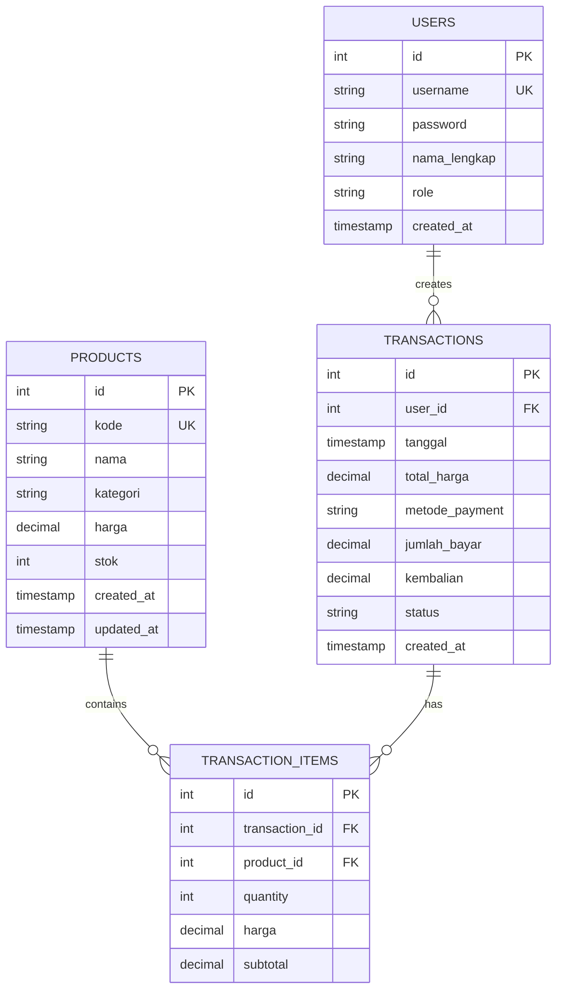

# 03 - Database Design

## ERD (Entity Relationship Diagram)



### Relationships
1. **USERS → TRANSACTIONS** (1:N)
   - 1 User bisa memiliki banyak transaksi
   - Foreign Key: `transactions.user_id` → `users.id`

2. **PRODUCTS → TRANSACTION_ITEMS** (1:N)
   - 1 Produk bisa dipesan berkali-kali
   - Foreign Key: `transaction_items.product_id` → `products.id`

3. **TRANSACTIONS → TRANSACTION_ITEMS** (1:N)
   - 1 Transaksi bisa memiliki banyak items
   - Foreign Key: `transaction_items.transaction_id` → `transactions.id`

---

## Schema SQL (DDL)

### Create Table: USERS
```sql
CREATE TABLE users (
    id SERIAL PRIMARY KEY,
    username VARCHAR(50) NOT NULL UNIQUE,
    password VARCHAR(255) NOT NULL,
    nama_lengkap VARCHAR(100) NOT NULL,
    role VARCHAR(20) NOT NULL CHECK (role IN ('KASIR', 'ADMIN')),
    created_at TIMESTAMP DEFAULT CURRENT_TIMESTAMP
);

CREATE INDEX idx_users_username ON users(username);
```

### Create Table: PRODUCTS
```sql
CREATE TABLE products (
    id SERIAL PRIMARY KEY,
    kode VARCHAR(50) NOT NULL UNIQUE,
    nama VARCHAR(100) NOT NULL,
    kategori VARCHAR(50) NOT NULL,
    harga DECIMAL(10, 2) NOT NULL,
    stok INTEGER NOT NULL DEFAULT 0,
    created_at TIMESTAMP DEFAULT CURRENT_TIMESTAMP,
    updated_at TIMESTAMP DEFAULT CURRENT_TIMESTAMP
);

CREATE INDEX idx_products_kategori ON products(kategori);
CREATE INDEX idx_products_nama ON products(nama);
```

### Create Table: TRANSACTIONS
```sql
CREATE TABLE transactions (
    id SERIAL PRIMARY KEY,
    user_id INTEGER NOT NULL REFERENCES users(id) ON DELETE RESTRICT,
    tanggal TIMESTAMP DEFAULT CURRENT_TIMESTAMP,
    total_harga DECIMAL(10, 2) NOT NULL,
    -- Metode pembayaran diselaraskan dengan aplikasi: TUNAI, EWALLET (opsional: TRANSFER)
    metode_payment VARCHAR(20) NOT NULL CHECK (metode_payment IN ('TUNAI', 'EWALLET', 'TRANSFER')),
    jumlah_bayar DECIMAL(10, 2) NOT NULL,
    kembalian DECIMAL(10, 2) NOT NULL,
    status VARCHAR(20) NOT NULL DEFAULT 'Sukses' CHECK (status IN ('Sukses', 'Pending', 'Dibatalkan')),
    created_at TIMESTAMP DEFAULT CURRENT_TIMESTAMP
);

CREATE INDEX idx_transactions_user_id ON transactions(user_id);
CREATE INDEX idx_transactions_tanggal ON transactions(tanggal);
```

### Create Table: TRANSACTION_ITEMS
```sql
CREATE TABLE transaction_items (
    id SERIAL PRIMARY KEY,
    transaction_id INTEGER NOT NULL REFERENCES transactions(id) ON DELETE CASCADE,
    product_id INTEGER NOT NULL REFERENCES products(id) ON DELETE RESTRICT,
    quantity INTEGER NOT NULL,
    harga DECIMAL(10, 2) NOT NULL,
    subtotal DECIMAL(10, 2) NOT NULL
);

CREATE INDEX idx_transaction_items_transaction_id ON transaction_items(transaction_id);
CREATE INDEX idx_transaction_items_product_id ON transaction_items(product_id);
```

---

## Data Seed (Sample Data)

### Insert Users
```sql
INSERT INTO users (username, password, nama_lengkap, role) VALUES
('admin', '12345', 'Administrator', 'ADMIN'),
('kasir', '12345', 'Andi Wijaya', 'KASIR'),
('kasir2', '12345', 'Budi Santoso', 'KASIR');
```

### Insert Products
```sql
INSERT INTO products (kode, nama, kategori, harga, stok) VALUES
('SAY-001', 'Bayam Segar', 'Sayuran', 15000, 50),
('SAY-002', 'Kangkung Segar', 'Sayuran', 12000, 40),
('SAY-003', 'Wortel Organik', 'Sayuran', 18000, 30),
('BUH-001', 'Apel Merah', 'Buah', 45000, 25),
('BUH-002', 'Jeruk Manis', 'Buah', 35000, 35),
('REM-001', 'Kunyit Segar', 'Rempah', 8000, 20),
('REM-002', 'Jahe Merah', 'Rempah', 10000, 15),
('LIN-001', 'Bawang Putih', 'Lainnya', 25000, 50),
('LIN-002', 'Bawang Merah', 'Lainnya', 30000, 40);
```

### Insert Sample Transactions
```sql
INSERT INTO transactions (user_id, total_harga, metode_payment, jumlah_bayar, kembalian, status) VALUES
(2, 150000, 'CASH', 200000, 50000, 'Sukses'),
(2, 85000, 'TRANSFER', 85000, 0, 'Sukses'),
(3, 210000, 'DEBIT', 210000, 0, 'Sukses');

INSERT INTO transaction_items (transaction_id, product_id, quantity, harga, subtotal) VALUES
(1, 1, 5, 15000, 75000),
(1, 4, 2, 45000, 90000),
(2, 2, 3, 12000, 36000),
(2, 8, 2, 25000, 50000),
(3, 5, 3, 35000, 105000),
(3, 6, 10, 8000, 80000),
(3, 9, 1, 30000, 30000);
```

---

## Database Configuration

### Connection Details
```
Host: localhost
Port: 5432
Database: agripos_db
Username: postgres
Password: [sesuai setup lokal]
Driver: PostgreSQL JDBC (org.postgresql.Driver)
```

### Connection String
```
jdbc:postgresql://localhost:5432/agripos_db?useSSL=false&serverTimezone=UTC
```

### Database Setup Script
```bash
# 1. Create database
createdb agripos_db

# 2. Run schema script
psql agripos_db < agripos_schema.sql

# 3. Verify tables
psql agripos_db -c "\dt"
```

---

## Database Constraints & Rules

### Primary Key Rules
- Setiap tabel memiliki PK (auto-increment INTEGER)
- Unique constraint pada username dan kode produk

### Foreign Key Rules
- `transactions.user_id` → `users.id` (ON DELETE RESTRICT)
- `transaction_items.transaction_id` → `transactions.id` (ON DELETE CASCADE)
- `transaction_items.product_id` → `products.id` (ON DELETE RESTRICT)

### Data Type Decisions
- `DECIMAL(10, 2)` untuk harga (precision untuk uang)
- `VARCHAR` untuk string variable length
- `TIMESTAMP` untuk audit trail (created_at, updated_at)
- `SERIAL` untuk auto-increment ID

### Check Constraints
- Role hanya: KASIR, ADMIN
- Metode pembayaran: CASH, TRANSFER, DEBIT
- Status transaksi: Sukses, Pending, Dibatalkan

---

## Indexing Strategy

### Indexes untuk Performance
```sql
-- Search users
CREATE INDEX idx_users_username ON users(username);

-- Filter products
CREATE INDEX idx_products_kategori ON products(kategori);
CREATE INDEX idx_products_nama ON products(nama);

-- Report queries
CREATE INDEX idx_transactions_user_id ON transactions(user_id);
CREATE INDEX idx_transactions_tanggal ON transactions(tanggal);

-- Detail items
CREATE INDEX idx_transaction_items_transaction_id ON transaction_items(transaction_id);
CREATE INDEX idx_transaction_items_product_id ON transaction_items(product_id);
```

---

## Backup & Recovery

### Backup Database
```bash
pg_dump agripos_db > agripos_backup_$(date +%Y%m%d).sql
```

### Restore Database
```bash
psql agripos_db < agripos_backup_20260114.sql
```

---

## Migration Notes

### Version 1.0 (Current)
- Initial schema with Users, Products, Transactions
- Support untuk multiple payment methods
- Transaction items tracking

### Future Migrations
- Add `last_login` to users table
- Add `discount` column to transactions
- Add product image storage
- Add customer information (customer table)
