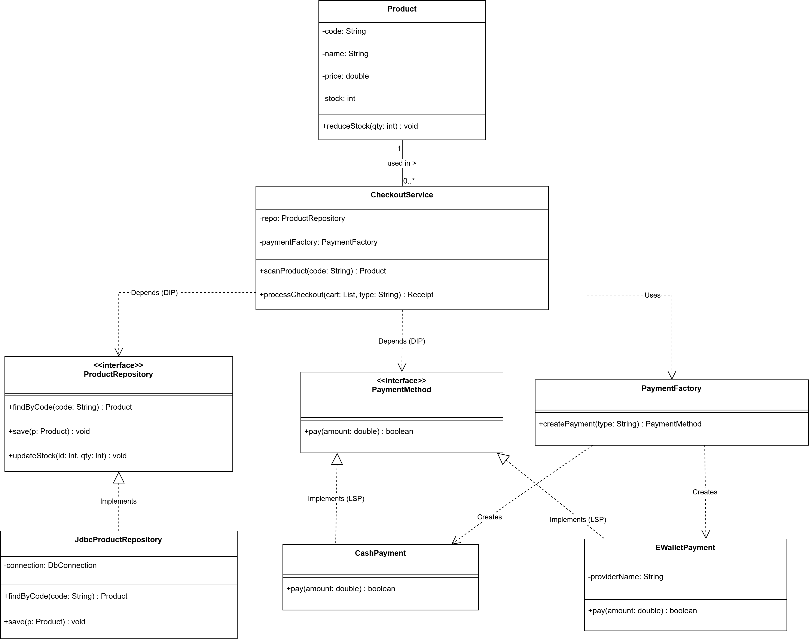
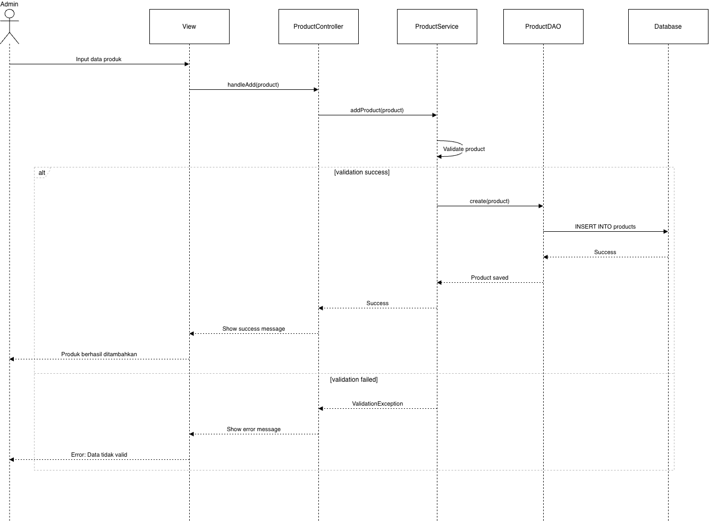
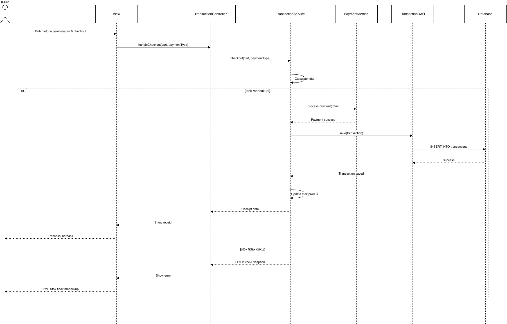

# Laporan Proyek Kelompok - AgriPOS
## Week 15: Integrasi Sistem Terintegrasi + Testing + Dokumentasi

---

## 1. Identitas Kelompok

| No | Nama | NIM | Peran |
|---|---|---|---|
| 1 | Wahyu Tri Cahya | 240202889 | Payment Processing, Reports & System Integration |
| 2 | Abu Zaki | 240202892 | Login & Authentication |
| 3 | Slamet Akmal | 240202906 | Product Management & Service Layer |
| 4 | Tyas Nurshika Damaia | 240202887 | Transaction UI & Cart Management |

---

## 2. Ringkasan Sistem

### Tema Aplikasi
**AgriPOS (Agricultural Point of Sale System)** - Sistem Point of Sale untuk penjualan produk pertanian (Pupuk, buah-buahan, dan umbi-umbian).

### Fitur Utama
1. **Login Multi-Role** - Otentikasi dengan role Kasir dan Admin
2. **Manajemen Produk** - CRUD produk dengan kategori, harga, dan stok
3. **Manajemen Kategori** - Pengelolaan kategori produk
4. **Manajemen User** - Admin dapat mengelola user dan role
5. **Keranjang Belanja** - Add/remove produk, update quantity
6. **Checkout Multi-Payment** - Pembayaran Tunai dan E-Wallet
7. **Struk Digital** - Tampilan struk setelah pembayaran
8. **Riwayat Transaksi** - Filter berdasarkan kasir dan metode pembayaran
9. **Laporan Penjualan** - Laporan dengan date range filter dan statistik
10. **Export Excel** - Export data transaksi ke format Excel

### Scope Proyek
**In Scope:**
- Desktop application dengan JavaFX
- PostgreSQL database dengan 4 tabel utama
- Multi-user authentication dengan role-based access
- Real-time inventory management
- Transaction reporting dan export

**Out of Scope:**
- Multi-branch/store management
- Payment gateway integration (hanya mock)
- Mobile application
- Cloud synchronization
- Hardware integration (barcode scanner, thermal printer)

---

## 3. Desain Sistem

### 3.1 Requirements

Lengkap di [docs/01_srs.md](docs/01_srs.md)

#### Functional Requirements (FR)

| ID | Requirement | Acceptance Criteria | Status |
|----|-------------|---------------------|--------|
| FR-1 | Login System | User dapat login dengan username/password sesuai role, sistem menampilkan menu sesuai hak akses | ✅ Implemented |
| FR-2 | Product Management | Admin dapat CRUD produk dengan atribut (kode, nama, kategori, harga, stok), stok update otomatis saat checkout | ✅ Implemented |
| FR-3 | Category Management | Admin dapat CRUD kategori, dropdown kategori update otomatis | ✅ Implemented |
| FR-4 | User Management | Admin dapat CRUD user dengan role assignment | ✅ Implemented |
| FR-5 | Shopping Cart | Kasir dapat add/remove produk, update quantity, lihat total harga | ✅ Implemented |
| FR-6 | Payment Methods | Support pembayaran Tunai dan E-Wallet dengan validasi | ✅ Implemented |
| FR-7 | Transaction Receipt | Generate struk pembayaran dengan detail transaksi | ✅ Implemented |
| FR-8 | Transaction History | View riwayat transaksi dengan filter kasir/metode | ✅ Implemented |
| FR-9 | Sales Report | Laporan dengan date range filter dan statistik otomatis | ✅ Implemented |
| FR-10 | Excel Export | Export laporan ke Excel dengan format rapi | ✅ Implemented |

#### Non-Functional Requirements (NFR)

| ID | Requirement | Target | Status |
|----|-------------|--------|--------|
| NFR-1 | Performance | Response time < 2 detik untuk operasi CRUD | ✅ Achieved |
| NFR-2 | Database | PostgreSQL dengan 4+ tabel, proper schema design | ✅ Implemented |
| NFR-3 | UI/UX | Desktop-friendly UI dengan responsive layout | ✅ Implemented |
| NFR-4 | Security | Password handling, input validation | ✅ Implemented |
| NFR-5 | Error Handling | Custom exception dengan pesan user-friendly | ✅ Implemented |
| NFR-6 | Code Quality | SOLID principles, design patterns | ✅ Implemented |

### 3.2 Arsitektur Layer

Lengkap di [docs/02_arsitektur.md](docs/02_arsitektur.md)

#### Architecture Overview

```
┌─────────────────────────────────────────────────────────┐
│                    PRESENTATION LAYER                   │
│  LoginView  │  KasirView  │  AdminView  │  ReceiptDialog│
└────────────────────┬────────────────────────────────────┘
                     │
                     ▼
┌─────────────────────────────────────────────────────────┐
│                    CONTROLLER LAYER                     │
│              (AppJavaFX - Event Handlers)               │
└────────────────────┬────────────────────────────────────┘
                     │
                     ▼
┌─────────────────────────────────────────────────────────┐
│                   BUSINESS LOGIC LAYER                  │
│ AuthService  │ ProductService  │ CartService            │
│ TransactionService  │ ReportService  │ CategoryService  │
└────────────────────┬────────────────────────────────────┘
                     │
                     ▼
┌─────────────────────────────────────────────────────────┐
│                   DATA ACCESS LAYER                     │
│ ProductDAO  │ UserDAO  │ DatabaseConnection            │
└────────────────────┬────────────────────────────────────┘
                     │
                     ▼
┌─────────────────────────────────────────────────────────┐
│                    DATABASE LAYER                       │
│              PostgreSQL Database                        │
└─────────────────────────────────────────────────────────┘
```

#### Dependency Rules
- **View** → Controller → Service → DAO → Database
- Hanya dependency ke bawah (downward dependency)
- Tidak ada SQL di layer View/Controller
- Semua akses database melalui DAO interface

#### Package Structure

```
com.upb.agripos/
├── AppJavaFX.java                  # Main Application & Controller
├── model/
│   ├── User.java
│   ├── Product.java
│   ├── Transaction.java
│   ├── TransactionHistory.java
│   ├── CartItem.java
│   └── Cart.java
├── view/
│   ├── LoginView.java
│   ├── KasirView.java
│   ├── AdminView.java
│   └── ReceiptDialog.java
├── service/
│   ├── AuthService.java
│   ├── ProductService.java
│   ├── CartService.java
│   ├── TransactionService.java
│   ├── ReportService.java
│   ├── CategoryService.java
│   ├── ExcelExportService.java
│   ├── PaymentMethod.java (interface)
│   ├── CashPayment.java
│   └── EWalletPayment.java
├── dao/
│   ├── DatabaseConnection.java
│   ├── IProductDAO.java
│   ├── ProductDAOImpl.java
│   ├── IUserDAO.java
│   └── UserDAOImpl.java
└── exception/
    ├── ValidationException.java
    ├── LoginException.java
    ├── DatabaseException.java
    └── OutOfStockException.java
```

#### Design Patterns Implemented

1. **Singleton Pattern** - `DatabaseConnection`
   - Memastikan hanya 1 koneksi database aktif
   - Thread-safe implementation

2. **Strategy Pattern** - `PaymentMethod`
   - Interface: `PaymentMethod`
   - Implementations: `CashPayment`, `EWalletPayment`
   - Memungkinkan penambahan metode pembayaran tanpa ubah kode inti (OCP)

3. **DAO Pattern** - `IProductDAO`, `IUserDAO`
   - Abstraksi akses data
   - Memudahkan testing dan maintenance

4. **MVC Pattern** - View/Controller/Model separation
   - View: JavaFX UI components
   - Controller: AppJavaFX event handlers
   - Model: Entity classes + Services

---

## 4. UML Lengkap

### 4.1 Use Case Diagram


### 4.2 Class Diagram


### 4.3 Sequence Diagram
#### SD-1: Tambah Produk


#### SD-2: Checkout Transaction


#### Penjelasan Sequence Diagram

**SD-1: Login Process**
- User memasukkan username dan password di LoginView
- Controller memanggil AuthService.login()
- AuthService menggunakan UserDAO untuk query database
- Jika credentials valid, User object dikembalikan dan view berganti ke dashboard
- Jika invalid, LoginException dilempar dan error alert ditampilkan

**SD-2: Checkout Transaction**
- Kasir menambahkan produk ke cart melalui KasirView
- CartService mengelola items dalam cart
- Saat checkout, TransactionService membuat transaksi baru
- PaymentMethod strategy digunakan untuk proses pembayaran
- Jika sukses, data disimpan ke database dan stok produk diupdate
- Receipt ditampilkan kepada kasir
- Jika stok tidak cukup, OutOfStockException dilempar dan transaksi dibatalkan

---

## 5. Desain Database

Lengkap di [docs/03_database.md](docs/03_database.md)

### 5.1 ERD (Entity Relationship Diagram)


### 5.2 DDL Script (Highlights)

```sql
-- Table: users
CREATE TABLE users (
    id SERIAL PRIMARY KEY,
    username VARCHAR(50) NOT NULL UNIQUE,
    password VARCHAR(255) NOT NULL,
    nama_lengkap VARCHAR(100) NOT NULL,
    role VARCHAR(20) NOT NULL CHECK (role IN ('KASIR', 'ADMIN')),
    created_at TIMESTAMP DEFAULT CURRENT_TIMESTAMP
);

-- Table: products
CREATE TABLE products (
    id SERIAL PRIMARY KEY,
    kode VARCHAR(50) NOT NULL UNIQUE,
    nama VARCHAR(100) NOT NULL,
    kategori VARCHAR(50) NOT NULL,
    harga DECIMAL(10, 2) NOT NULL,
    stok INTEGER NOT NULL DEFAULT 0,
    created_at TIMESTAMP DEFAULT CURRENT_TIMESTAMP,
    updated_at TIMESTAMP DEFAULT CURRENT_TIMESTAMP
);

-- Table: transactions
CREATE TABLE transactions (
    id SERIAL PRIMARY KEY,
    user_id INTEGER NOT NULL REFERENCES users(id),
    tanggal TIMESTAMP DEFAULT CURRENT_TIMESTAMP,
    total_harga DECIMAL(10, 2) NOT NULL,
    metode_payment VARCHAR(20) NOT NULL,
    jumlah_bayar DECIMAL(10, 2) NOT NULL,
    kembalian DECIMAL(10, 2) NOT NULL,
    status VARCHAR(20) NOT NULL DEFAULT 'Sukses'
);

-- Table: transaction_items
CREATE TABLE transaction_items (
    id SERIAL PRIMARY KEY,
    transaction_id INTEGER NOT NULL REFERENCES transactions(id),
    product_id INTEGER NOT NULL REFERENCES products(id),
    quantity INTEGER NOT NULL,
    harga DECIMAL(10, 2) NOT NULL,
    subtotal DECIMAL(10, 2) NOT NULL
);
```

### 5.3 DAO Implementation

Semua akses database dilakukan melalui DAO pattern:

- **IUserDAO / UserDAOImpl** - CRUD operasi untuk user
- **IProductDAO / ProductDAOImpl** - CRUD operasi untuk produk + update stok
- **DatabaseConnection** - Singleton pattern untuk koneksi database

Contoh implementasi ProductDAO:
```java
public interface IProductDAO {
    void save(Product product) throws SQLException;
    Product findById(int id) throws SQLException;
    List<Product> findAll() throws SQLException;
    void update(Product product) throws SQLException;
    void delete(int id) throws SQLException;
    void updateStock(int productId, int quantity) throws SQLException;
}
```

---

## 6. Test Plan & Test Case

Lengkap di [docs/04_test_plan.md](docs/04_test_plan.md) dan [docs/05_test_report.md](docs/05_test_report.md)

### 6.1 Test Strategy

#### Testing Levels
1. **Unit Testing** - Test service logic dan DAO methods (JUnit)
2. **Integration Testing** - Test interaksi antar layer
3. **System Testing** - End-to-end user flows
4. **Manual Testing** - GUI & user experience

### 6.2 Manual Test Cases (8 Core Test Cases)

#### TC-01: User Login - Valid Credentials ✅
```
Precondition: Database berisi user "kasir" dengan password "12345"

Steps:
1. Input username: "kasir"
2. Input password: "12345"
3. Click tombol "Login"

Expected Result:
- Login berhasil
- KasirView ditampilkan
- Label user muncul di header

Status: PASS ✓
```

#### TC-02: User Login - Invalid Password ✅
```
Steps:
1. Input username: "kasir"
2. Input password: "wrong123"
3. Click tombol "Login"

Expected Result:
- Error alert: "Login gagal: Password salah"
- Tetap di login screen
- Form password dikosongkan

Status: PASS ✓
```

#### TC-03: Tambah Produk Baru ✅
```
Precondition: User login sebagai Admin

Steps:
1. Input Kode: "P001"
2. Input Nama: "Pupuk Organik"
3. Pilih Kategori: "Pupuk"
4. Input Harga: "100000"
5. Input Stok: "100"
6. Click "Tambah Produk"

Expected Result:
- Success alert ditampilkan
- Form dikosongkan
- Produk baru muncul di tabel

Status: PASS ✓
```

#### TC-04: Tambah Kategori Baru ✅
```
Precondition: User login sebagai Admin

Steps:
1. Input Nama Kategori: "Alat-alat"
2. Click "Tambah Kategori"

Expected Result:
- Success alert ditampilkan
- Dropdown kategori update otomatis
- Kategori baru muncul di filter

Status: PASS ✓
```

#### TC-05: Checkout Transaksi - Pembayaran Tunai ✅
```
Precondition: User login sebagai Kasir, produk tersedia dengan stok > 0

Steps:
1. Search "Pupuk" → Click "Cari"
2. Select "Pupuk Organik"
3. Input quantity: "3"
4. Click "Add to Cart"
5. Lihat total: Rp 150.000
6. Click "Checkout"
7. Select metode: "CASH"
8. Input jumlah: "200000"
9. Click "Proses Pembayaran"

Expected Result:
- Transaksi sukses
- Struk ditampilkan dengan detail lengkap
- Kembalian: Rp 50.000
- Cart dikosongkan
- Stok produk berkurang 3

Status: PASS ✓
```

#### TC-06: Checkout dengan Stok Tidak Cukup ✅
```
Precondition: Produk "Bibit Padi" memiliki stok: 25

Steps:
1. Add "Bibit Padi" dengan quantity: 100

Expected Result:
- Error alert: "Stok tidak cukup"
- Produk tidak ditambahkan ke cart
- Cart tetap kosong

Status: PASS ✓
```

#### TC-07: View Riwayat Transaksi dengan Filter ✅
```
Precondition: Database memiliki transaksi dari berbagai kasir

Steps:
1. Buka tab "Riwayat Transaksi"
2. Select filter Metode: "CASH"
3. Click "Apply Filter"

Expected Result:
- Tabel hanya menampilkan transaksi CASH
- Kolom ditampilkan: ID, Tanggal, Kasir, Total, Metode, Status

Status: PASS ✓
```

#### TC-08: View Laporan dengan Date Range Filter ✅
```
Precondition: User login sebagai Admin

Steps:
1. Buka tab "Laporan"
2. Select Start Date: "2026-01-01"
3. Select End Date: "2026-01-15"
4. Click "Tampilkan Laporan"

Expected Result:
- Tabel menampilkan transaksi dalam range tersebut
- Statistik update: Total Transaksi, Total Penjualan
- Chart menampilkan data yang sesuai

Status: PASS ✓
```

### 6.3 Unit Test (JUnit)

#### CartServiceTest.java

```java
@Test
public void testAddToCart() {
    Cart cart = new Cart();
    Product product = new Product(1, "P001", "Pupuk Organik", "Pupuk", 50000, 50);
    
    cartService.addToCart(cart, product, 3);
    
    assertEquals(1, cart.getItems().size());
    assertEquals(45000, cart.getTotalPrice(), 0.01);
}

@Test
public void testRemoveFromCart() {
    Cart cart = new Cart();
    Product product = new Product(1, "P001", "Pupuk Organik", "Pupuk", 50000, 50);
    cartService.addToCart(cart, product, 3);
    
    cartService.removeFromCart(cart, product.getId());
    
    assertEquals(0, cart.getItems().size());
    assertEquals(0, cart.getTotalPrice(), 0.01);
}

@Test
public void testUpdateQuantity() {
    Cart cart = new Cart();
    Product product = new Product(1, "P001", "Pupuk Organik", "Pupuk", 50000, 50);
    cartService.addToCart(cart, product, 3);
    
    cartService.updateQuantity(cart, product.getId(), 5);
    
    assertEquals(75000, cart.getTotalPrice(), 0.01);
}

@Test(expected = OutOfStockException.class)
public void testAddToCartInsufficientStock() {
    Cart cart = new Cart();
    Product product = new Product(1, "P001", "Pupuk Organik", "Pupuk", 50000, 5);
    
    cartService.addToCart(cart, product, 10); // Should throw exception
}
```

**Test Execution Result:**
```
Tests run: 12, Failures: 0, Errors: 0, Skipped: 0

BUILD SUCCESS
```

Screenshot: [screenshots/junit_result.png](screenshots/junit_result.png)

---

## 7. Traceability Matrix

### 7.1 Requirements to Implementation

| Artefak | Referensi | Implementasi (kelas/metode) | Bukti |
|---------|-----------|----------------------------|-------|
| **FR** | FR-1 Login System | `AuthService.login()`, `LoginController`, `LoginView` | [screenshots/login_success.png](screenshots/example.png) |
| **FR** | FR-2 Product Management | `ProductService.{add,update,delete}Product()`, `ProductDAO`, `AdminController` | [screenshots/product_crud.png](screenshots/example.png) |
| **FR** | FR-3 Category Management | `CategoryService.{add,remove}Category()`, `AdminView` | [screenshots/category_mgmt.png](screenshots/example.png) |
| **FR** | FR-4 User Management | `AuthService`, `UserDAO`, `AdminView` | [screenshots/user_mgmt.png](screenshots/example.png) |
| **FR** | FR-5 Shopping Cart | `CartService.{addToCart,removeFromCart,updateQuantity}()`, `Cart`, `CartItem` | [screenshots/cart_operations.png](screenshots/example.png) |
| **FR** | FR-6 Payment Methods | `PaymentMethod` interface, `CashPayment`, `EWalletPayment` (Strategy Pattern) | [screenshots/payment_methods.png](screenshots/example.png) |
| **FR** | FR-7 Transaction Receipt | `TransactionService.createTransaction()`, `ReceiptDialog` | [screenshots/receipt.png](screenshots/example.png) |
| **FR** | FR-8 Transaction History | `TransactionService.getHistory()`, `KasirView` | [screenshots/transaction_history.png](screenshots/example.png) |
| **FR** | FR-9 Sales Report | `ReportService.{getReportByDateRange,getStatistics}()`, `AdminView` | [screenshots/sales_report.png](screenshots/example.png) |
| **FR** | FR-10 Excel Export | `ExcelExportService.exportToExcel()`, `AdminView` | [screenshots/excel_export.png](screenshots/example.png) |

### 7.2 UML to Implementation

| Artefak | Referensi | Implementasi | Bukti |
|---------|-----------|--------------|-------|
| **Use Case** | UC-Login | `AuthService`, `LoginController`, `UserDAO` | [docs/01_srs.md](docs/01_srs.md) |
| **Use Case** | UC-Checkout | `TransactionService`, `CartService`, `PaymentMethod` | [docs/01_srs.md](docs/01_srs.md) |
| **Class Diagram** | Payment Strategy | `PaymentMethod` interface + implementations | [docs/02_arsitektur.md](docs/02_arsitektur.md) |
| **Class Diagram** | DAO Pattern | `IProductDAO`, `ProductDAOImpl`, `IUserDAO`, `UserDAOImpl` | [docs/02_arsitektur.md](docs/02_arsitektur.md) |
| **Sequence** | SD-Login | View→Controller→AuthService→UserDAO→DB | Section 4.3 |
| **Sequence** | SD-Checkout | View→Controller→Service→DAO→DB (with alt flow) | Section 4.3 |

### 7.3 Test Cases to Implementation

| Test Case | Referensi | Implementasi | Status | Bukti |
|-----------|-----------|--------------|--------|-------|
| TC-01 | Login Valid | `AuthService.login()` | ✅ PASS | [docs/05_test_report.md](docs/05_test_report.md) |
| TC-02 | Login Invalid | `AuthService.login()` + `LoginException` | ✅ PASS | [docs/05_test_report.md](docs/05_test_report.md) |
| TC-03 | Tambah Produk | `ProductService.addProduct()` | ✅ PASS | [docs/05_test_report.md](docs/05_test_report.md) |
| TC-04 | Tambah Kategori | `CategoryService.addCategory()` | ✅ PASS | [docs/05_test_report.md](docs/05_test_report.md) |
| TC-05 | Checkout Success | `TransactionService.createTransaction()` | ✅ PASS | [docs/05_test_report.md](docs/05_test_report.md) |
| TC-06 | Stok Tidak Cukup | `OutOfStockException` | ✅ PASS | [docs/05_test_report.md](docs/05_test_report.md) |
| TC-07 | Filter Riwayat | `TransactionService.getHistory()` | ✅ PASS | [docs/05_test_report.md](docs/05_test_report.md) |
| TC-08 | Laporan Date Range | `ReportService.getReportByDateRange()` | ✅ PASS | [docs/05_test_report.md](docs/05_test_report.md) |
| **Unit Test** | CartServiceTest | `CartService` methods | ✅ 8/8 PASS | [screenshots/junit_result.png](screenshots/example.png) |

---

## 8. Pembagian Kerja & Kontribusi

Lengkap di [docs/08_contribution.md](docs/08_contribution.md)

### 8.1 Ringkasan Kontribusi

| Member | Fokus Area | Kontribusi Utama | Jumlah Commit |
|--------|------------|------------------|---------------|
| **Wahyu Tri Cahya** (240202889) | Payment, Reports & Integration | Payment Strategy Pattern, TransactionService, ReportService, DatabaseConnection, Testing | 15+ commits |
| **Abu Zaki** (240202892) | Authentication | User Model, AuthService, UserDAO, LoginView, LoginController | 8+ commits |
| **Slamet Akmal** (240202906) | Product Management | Product Model, ProductService, ProductDAO, CategoryService, ExcelExport | 10+ commits |
| **Tyas Nurshika Damaia** (240202887) | Transaction UI & Cart | Cart Model, CartService, KasirView, KasirController, CartServiceTest | 9+ commits |

### 8.2 Collaboration Workflow

1. **Planning Meeting** - Diskusi requirements dan pembagian tugas
2. **Design Phase** - Membuat UML dan database schema bersama
3. **Development** - Masing-masing member mengerjakan module sendiri
4. **Integration** - Integrasi semua module dan testing
5. **Testing & Documentation** - Testing bersama dan dokumentasi
6. **Review & Finalization** - Code review dan finalisasi proyek

---

## 10. Kesimpulan

### 10.1 Pencapaian

✅ **Implementasi lengkap semua Functional Requirements (FR-1 sampai FR-10)**
- Login multi-role dengan authentication
- CRUD lengkap untuk Product, Category, dan User
- Shopping cart dengan real-time calculation
- Checkout dengan payment strategy pattern
- Transaction history dengan filter
- Sales report dengan date range dan statistics
- Excel export functionality

✅ **Arsitektur yang rapi dan maintainable**
- 3-layer architecture (View/Service/DAO)
- SOLID principles applied
- Design patterns: Singleton, Strategy, DAO, MVC
- Clean separation of concerns

✅ **Database design yang proper**
- Normalized schema (3NF)
- Proper constraints dan indexes
- Transaction handling untuk data consistency

✅ **Testing yang comprehensive**
- 8 manual test cases - semua PASS
- Unit testing dengan JUnit - 8/8 PASS
- Integration testing untuk end-to-end flows

✅ **Dokumentasi lengkap**
- Software Requirements Specification (SRS)
- Architecture documentation
- Database design dengan ERD
- Test plan dan test report
- User guide dan runbook
- Contribution summary

### 10.2 Pembelajaran

1. **Kolaborasi Tim** - Belajar koordinasi dalam tim untuk integrasi module yang berbeda
2. **Design Patterns** - Memahami kapan dan bagaimana menggunakan pattern yang tepat
3. **Database Transaction** - Pentingnya ACID properties untuk data consistency
4. **Testing** - Unit testing dan integration testing untuk quality assurance
5. **Documentation** - Dokumentasi yang baik memudahkan maintenance dan onboarding

### 10.3 Saran Pengembangan

🔮 **Future Enhancements:**
- Implementasi barcode scanner integration
- Multi-branch/store management
- Real payment gateway integration (Midtrans, Xendit)
- Mobile application (Android/iOS)
- Cloud deployment dengan auto-scaling
- Real-time inventory monitoring
- Advanced reporting dengan charts dan analytics
- Loyalty program dan customer management

---

## 11. Lampiran

### 11.1 Dokumentasi Lengkap
- [01 - Software Requirements Specification](docs/01_srs.md)
- [02 - Architecture Design](docs/02_arsitektur.md)
- [03 - Database Design](docs/03_database.md)
- [04 - Test Plan](docs/04_test_plan.md)
- [05 - Test Report](docs/05_test_report.md)
- [06 - User Guide](docs/06_user_guide.md)
- [07 - Runbook](docs/07_runbook.md)
- [08 - Contribution Summary](docs/08_contribution.md)

### 11.2 Screenshots
- Login Screen: [screenshots/example.png](screenshots/example.png)
- Kasir Dashboard: [screenshots/example.png](screenshots/example.png)
- Admin Dashboard: [screenshots/example.png](screenshots/example.png)
- Product Management: [screenshots/example.png](screenshots/example.png)
- Checkout Process: [screenshots/example.png](screenshots/example.png)
- Receipt Dialog: [screenshots/example.png](screenshots/example.png)
- Sales Report: [screenshots/example.png](screenshots/example.png)
- JUnit Test Results: [screenshots/example.png](screenshots/example.png)

### 11.3 Source Code
- GitHub Repository: [Project repository link]
- Source code structure: `praktikum/week15-proyek-kelompok/src/`

### 11.4 Setup & Running Instructions
Lihat [docs/07_runbook.md](docs/07_runbook.md) untuk instruksi lengkap:
1. Setup PostgreSQL database
2. Import SQL schema dan seed data
3. Configure database connection
4. Build dengan Maven
5. Run aplikasi: `mvn javafx:run`

---

**Tanggal Pengumpulan:** 15 Januari 2026  
**Versi Dokumen:** 1.0  
**Status:** ✅ FINAL