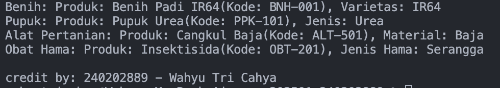

# Laporan Praktikum Minggu 4
Topik: Polymorphism (Info Produk)

## Identitas
- Nama  : Wahyu Tri Cahya
- NIM   : 240202889
- Kelas : 3IKRB

---

## Tujuan
- Mahasiswa mampu **menjelaskan konsep polymorphism** dalam OOP.  
- Mahasiswa mampu **membedakan method overloading dan overriding**.  
- Mahasiswa mampu **mengimplementasikan polymorphism (overriding, overloading, dynamic binding)** dalam program.  
- Mahasiswa mampu **menganalisis contoh kasus polymorphism** pada sistem nyata (Agri-POS).  

---

## Dasar Teori
Polymorphism berarti “banyak bentuk” dan memungkinkan objek yang berbeda merespons panggilan method yang sama dengan cara yang berbeda.  
1. **Overloading** → mendefinisikan method dengan nama sama tetapi parameter berbeda.  
2. **Overriding** → subclass mengganti implementasi method dari superclass.  
3. **Dynamic Binding** → pemanggilan method ditentukan saat runtime, bukan compile time.  

Dalam konteks Agri-POS, misalnya:  
- Method `getInfo()` pada `Produk` dioverride oleh `Benih`, `Pupuk`, `AlatPertanian` untuk menampilkan detail spesifik.  
- Method `tambahStok()` bisa dibuat overload dengan parameter berbeda (int, double).  

---

## Langkah Praktikum
1. **Overloading**  
   - Tambahkan method `tambahStok(int jumlah)` dan `tambahStok(double jumlah)` pada class `Produk`.  

2. **Overriding**  
   - Tambahkan method `getInfo()` pada superclass `Produk`.  
   - Override method `getInfo()` pada subclass `Benih`, `Pupuk`, dan `AlatPertanian`.  

3. **Dynamic Binding**  
   - Buat array `Produk[] daftarProduk` yang berisi objek `Benih`, `Pupuk`, dan `AlatPertanian`.  
   - Loop array tersebut dan panggil `getInfo()`. Perhatikan bagaimana Java memanggil method sesuai jenis objek aktual.  

4. **Main Class**  
   - Buat `MainPolymorphism.java` untuk mendemonstrasikan overloading, overriding, dan dynamic binding.  

5. **CreditBy**  
   - Tetap panggil `CreditBy.print("<NIM>", "<Nama>")`.  

6. **Commit dan Push**  
   - Commit dengan pesan: `week4-polymorphism`.  

---

## Kode Program

```java
   Produk[] daftarProduk = {
      new Benih("BNH-001", "Benih Padi IR64", 25000, 100, "IR64"),
      new Pupuk("PPK-101", "Pupuk Urea", 350000, 40, "Urea"),
      new AlatPertanian("ALT-501", "Cangkul Baja", 90000, 15, "Baja"),
      new ObatHama("OBT-201", "Insektisida", 150000, 25, "Serangga")
   };

   for (Produk p : daftarProduk) {
      System.out.println(p.getInfo()); // Dynamic Binding
   }

   CreditBy.print("240202889", "Wahyu Tri Cahya");
```
---

## Hasil Eksekusi

---

## Analisis
- Cara Kerja Program: Program mendemonstrasikan polymorphism dengan memanfaatkan array bertipe Produk yang berisi berbagai subclass (Benih, Pupuk, AlatPertanian, ObatHama). Saat getInfo() dipanggil, Java menggunakan dynamic binding untuk mengeksekusi method yang sesuai dengan objek aktual.
- Perbedaan dengan minggu sebelumnya: Minggu sebelumnya fokus pada inheritance (pewarisan). Pada minggu ini, objek tidak hanya mewarisi atribut dan method, tetapi juga dapat berperilaku berbeda meskipun dipanggil melalui referensi superclass.
- Kendala: -
---

## Kesimpulan
Melalui praktikum ini, dapat disimpulkan bahwa polymorphism merupakan konsep penting dalam OOP yang membuat program lebih fleksibel, efisien, dan mudah dikembangkan. Dengan overloading dan overriding, satu nama method dapat memiliki banyak implementasi sesuai konteksnya. Konsep dynamic binding memungkinkan Java memilih method yang sesuai dengan objek aktual pada saat runtime.

---

## Quiz
1. Apa perbedaan overloading dan overriding?
   **Jawaban:** Overloading terjadi ketika dua atau lebih method memiliki nama yang sama tetapi berbeda parameter (jumlah, urutan, atau tipe data), dan ditentukan saat compile-time (static binding). Sedangkan overriding terjadi ketika subclass mengganti implementasi method dari superclass dengan isi yang berbeda, dan ditentukan saat runtime (dynamic binding).

2. Bagaimana Java menentukan method mana yang dipanggil dalam dynamic binding?
   **Jawaban:** Java menentukan method yang dipanggil berdasarkan **objek aktual** yang dirujuk oleh variabel pada saat runtime, bukan berdasarkan tipe referensi variabelnya. Dengan demikian, jika sebuah variabel bertipe superclass mengacu ke objek subclass, maka method dari subclass yang akan dijalankan.

3. Berikan contoh kasus polymorphism dalam sistem POS selain produk pertanian.
   **Jawaban:** Dalam sistem POS restoran, class `MenuItem` bisa memiliki subclass seperti `Makanan`, `Minuman`, dan `Dessert`. Masing-masing subclass dapat meng-override method `getInfo()` untuk menampilkan detail menu spesifik seperti bahan, ukuran porsi, atau suhu penyajian. Saat daftar menu ditampilkan menggunakan array `MenuItem[]`, Java akan memanggil method `getInfo()` yang sesuai dengan tipe objek aktualnya.

