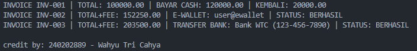

# Laporan Praktikum Minggu 5
Topik: Abstraction (Abstract Class & Interface)

## Identitas
- Nama  : Wahyu Tri Cahya
- NIM   : 240202889
- Kelas : 3IKRB

---

## Tujuan
- Mahasiswa mampu **menjelaskan perbedaan abstract class dan interface**.
- Mahasiswa mampu **mendesain abstract class dengan method abstrak** sesuai kebutuhan kasus.
- Mahasiswa mampu **membuat interface dan mengimplementasikannya pada class**.
- Mahasiswa mampu **menerapkan multiple inheritance melalui interface** pada rancangan kelas.
- Mahasiswa mampu **mendokumentasikan kode** (komentar kelas/method, README singkat pada folder minggu).

---

## Dasar Teori
**Abstraksi** adalah proses menyederhanakan kompleksitas dengan menampilkan elemen penting dan menyembunyikan detail implementasi.
- **Abstract class**: tidak dapat diinstansiasi, dapat memiliki method abstrak (tanpa badan) dan non-abstrak. Dapat menyimpan state (field).
- **Interface**: kumpulan kontrak (method tanpa implementasi konkret). Sejak Java 8 mendukung default method. Mendukung **multiple inheritance** (class dapat mengimplementasikan banyak interface).
- Gunakan **abstract class** bila ada _shared state_ dan perilaku dasar; gunakan **interface** untuk mendefinisikan kemampuan/kontrak lintas hierarki.

Dalam konteks Agri-POS, **Pembayaran** dapat dimodelkan sebagai abstract class dengan method abstrak `prosesPembayaran()` dan `biaya()`. Implementasi konkritnya: `Cash`, `EWallet`, dan `Transfer Bank`. Kemudian, interface seperti `Validatable` (mis. verifikasi OTP) dan `Receiptable` (mencetak bukti) dapat diimplementasikan oleh jenis pembayaran yang relevan.

---

## Langkah Praktikum
1. **Abstract Class – Pembayaran**
   - Buat `Pembayaran` (abstract) dengan field `invoiceNo`, `total` dan method:
     - `double biaya()` (abstrak) → biaya tambahan (fee).
     - `boolean prosesPembayaran()` (abstrak) → mengembalikan status berhasil/gagal.
     - `double totalBayar()` (konkrit) → `return total + biaya();`.

2. **Subclass Konkret**
   - `Cash` → biaya = 0, proses = selalu berhasil jika `tunai >= totalBayar()`.
   - `EWallet` → biaya = 1.5% dari `total`; proses = membutuhkan validasi.
   - `TransferBank` → biaya tetap Rp3.500, proses dianggap selalu berhasil.

3. **Interface**
   - `Validatable` → `boolean validasi();` (contoh: OTP).
   - `Receiptable` → `String cetakStruk();`

4. **Multiple Inheritance via Interface**
   - `EWallet` mengimplementasikan **dua interface**: `Validatable`, `Receiptable`.
   - `Cash` dan `TransferBank` mengimplementasikan `Receiptable`.

5. **Main Class**
    - Buat `MainAbstraction.java` untuk mendemonstrasikan pemakaian `Pembayaran` (polimorfik).
    - Tampilkan hasil proses dan struk. Di akhir, panggil `CreditBy.print("[NIM]", "[Nama]")`.

6. **Commit dan Push**
   - Commit dengan pesan: `week5-abstraction-interface`.

---

## Kode Program

```java
   Pembayaran cash = new Cash("INV-001", 100000, 120000);
   Pembayaran ew = new EWallet("INV-002", 150000, "user@ewallet", "123456");
   Pembayaran tb = new TransferBank("INV-003", 200000, "Bank WTC", "123-456-7890");

   System.out.println(((Receiptable) cash).cetakStruk());
   System.out.println(((Receiptable) ew).cetakStruk());
   System.out.println(((Receiptable) tb).cetakStruk());

   CreditBy.print("240202889", "Wahyu Tri Cahya");
```
---

## Hasil Eksekusi

---

## Analisis
Program pada minggu ini melanjutkan konsep dari minggu sebelumnya (Polymorphism) dengan fokus pada **Abstraction**, yaitu memisahkan antara definisi perilaku dan implementasinya.

- **Cara Kerja Program:**  
  Kelas `Pembayaran` bertindak sebagai **abstract class** yang mendefinisikan kerangka umum pembayaran. Subclass seperti `Cash`, `EWallet`, dan `TransferBank` mengimplementasikan method abstrak sesuai karakteristik masing-masing. `EWallet` juga mengimplementasikan interface `Validatable` dan `Receiptable`, memperlihatkan contoh **multiple inheritance via interface**. Program utama (`MainAbstraction`) mendemonstrasikan polymorphism dengan memanggil method `cetakStruk()` dari berbagai tipe pembayaran melalui referensi yang sama (`Pembayaran`).

- **Perbedaan dengan Minggu Sebelumnya:**  
  Minggu ke-4 menekankan **polymorphism** melalui overriding dan overloading untuk menampilkan perilaku berbeda pada subclass dengan method yang sama. Minggu ini lebih fokus pada **abstraksi dan kontrak perilaku**, di mana interface digunakan untuk mendefinisikan kemampuan tambahan tanpa mengikat hierarki. Abstract class memberikan fondasi perilaku umum, sedangkan interface memperluas fungsionalitas lintas kelas.

- **Kendala dan Solusi:**  
  Kendala utama adalah memastikan setiap subclass mengimplementasikan semua method abstrak dan kontrak interface dengan konsisten. Selain itu, diperlukan penyesuaian agar output `cetakStruk()` memiliki format seragam. Kendala tersebut diatasi dengan mendefinisikan template format yang sama di setiap subclass serta melakukan uji eksekusi untuk memverifikasi hasil.
---

## Kesimpulan
Dengan menggunakan **abstract class dan interface**, kode menjadi lebih fleksibel, terstruktur, dan mudah dikembangkan. Penambahan fitur baru seperti `TransferBank` dapat dilakukan tanpa memodifikasi kelas dasar.

---

## Quiz
1. Jelaskan perbedaan konsep dan penggunaan **abstract class** dan **interface**.  
   **Jawaban:** Abstract class digunakan untuk mendefinisikan perilaku dasar dengan kemungkinan memiliki implementasi, sedangkan interface hanya mendefinisikan kontrak perilaku tanpa implementasi konkret.

2. Mengapa **multiple inheritance** lebih aman dilakukan dengan interface pada Java?  
   **Jawaban:** Karena interface tidak membawa state, sehingga tidak menimbulkan konflik pewarisan ganda seperti pada class.

3. Pada contoh Agri-POS, bagian mana yang **paling tepat** menjadi abstract class dan mana yang menjadi interface? Jelaskan alasannya.  
   **Jawaban:** `Pembayaran` menjadi abstract class karena memiliki state dan perilaku dasar bersama, sedangkan `Validatable` dan `Receiptable` menjadi interface karena hanya mendefinisikan kontrak fungsi tambahan lintas tipe pembayaran.
