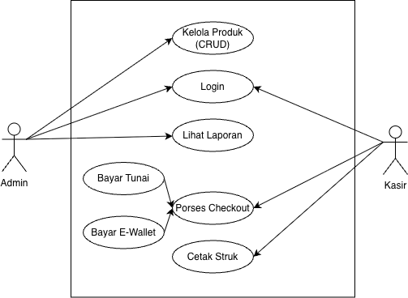

# Laporan Praktikum Minggu 6

Topik: Desain Arsitektur Sistem Agri-POS menggunakan UML dan Prinsip SOLID

## Identitas

* Nama  : Wahyu Tri Cahya
* NIM   : 240202889
* Kelas : 3IKRB

---

## Tujuan

* Mahasiswa memahami **desain arsitektur sistem menggunakan UML**.
* Mahasiswa memahami **penerapan prinsip SOLID dalam desain perangkat lunak**.
* Mahasiswa mampu **menganalisis hubungan antara kebutuhan fungsional dan desain UML**.
* Mahasiswa mampu **mengembangkan argumentasi desain berdasarkan prinsip OOP & SOLID**.

---

## Deskripsi Sistem Agri-POS

Agri-POS adalah sistem Point of Sale untuk penjualan produk pertanian (benih, pupuk, alat). Terdapat dua peran utama:

* **Admin** → Mengelola produk dan laporan.
* **Kasir** → Melakukan transaksi checkout dan pembayaran.

Kebutuhan Fungsional (FR) yang dicakup:

* Manajemen Produk (CRUD)
* Transaksi Penjualan (Checkout)
* Pembayaran Tunai & E-Wallet
* Pencetakan Struk
* Login & Hak Akses

---

## 1. Desain Arsitektur UML

Empat diagram UML disusun untuk menggambarkan struktur dan perilaku sistem.

### 1.1 Use Case Diagram

* Menjelaskan fungsi sistem dari sudut pandang aktor.
* Generalization digunakan pada metode pembayaran:

  * **Bayar Tunai** dan **Bayar E-Wallet** adalah bentuk khusus dari **Proses Checkout**.
* Include digunakan antara **Checkout** dan **Cetak Struk**.

**Aktor & Use Case:**

| Aktor | Use Case                            |
| ----- | ----------------------------------- |
| Admin | Kelola Produk, Lihat Laporan        |
| Kasir | Login, Proses Checkout, Cetak Struk |

### 1.2 Activity Diagram – Proses Checkout

* Menggambarkan alur kerja pembayaran.
* Swimlanes: **Kasir**, **Sistem**, **Payment Gateway**.
* Terdapat Decision Node untuk:

  * Validasi stok
  * Validasi saldo/uang

### 1.3 Sequence Diagram – Proses Pembayaran

Menjelaskan interaksi antar objek:

* CheckoutService meminta objek PaymentMethod dari PaymentFactory (OCP).
* CheckoutService memanggil `pay()` pada interface PaymentMethod (LSP & DIP).
* Blok **alt** untuk membedakan pembayaran Tunai vs E-Wallet.

### 1.4 Class Diagram

* Struktur statis sistem.
* Menggunakan interface dan dependency injection.
* Kelas utama:

  * CheckoutService
  * ProductService
  * PaymentMethod (Interface)
  * CashPayment, EWalletPayment (Implementasi)
  * PaymentFactory

---

## 2. Penerapan Prinsip SOLID

Desain Agri-POS menerapkan empat prinsip SOLID secara eksplisit.

| Prinsip     | Penjelasan                                        | Penerapan                                                                                |
| ----------- | ------------------------------------------------- | ---------------------------------------------------------------------------------------- |
| **S (SRP)** | Satu kelas → satu alasan berubah                  | CheckoutService fokus transaksi, ProductRepository fokus akses data.                     |
| **O (OCP)** | Terbuka untuk ekstensi, tertutup untuk modifikasi | Menambah metode pembayaran cukup membuat class baru (QrisPayment).                       |
| **L (LSP)** | Subclass dapat menggantikan parent                | CashPayment & EWalletPayment dapat digunakan sebagai PaymentMethod.                      |
| **I (ISP)** | Interface spesifik untuk klien                    | PaymentMethod hanya untuk pembayaran; ProductRepository hanya untuk CRUD.                |
| **D (DIP)** | High-level bergantung pada abstraksi              | CheckoutService bergantung pada ProductRepository interface, bukan implementasi konkret. |

---

## 3. Traceability Matrix (FR → Desain)

| FR                 | Use Case                | Activity/Sequence            | Realisasi                                                  |
| ------------------ | ----------------------- | ---------------------------- | ---------------------------------------------------------- |
| Manajemen Produk   | UC-Kelola Produk        | -                            | ProductService, ProductRepository, Product                 |
| Transaksi/Checkout | UC-Proses Checkout      | Activity Checkout            | CheckoutService, ProductService                            |
| Pembayaran         | UC-Bayar Tunai/E-Wallet | Sequence Pembayaran          | PaymentMethod, CashPayment, EWalletPayment, PaymentFactory |
| Cetak Struk        | UC-Cetak Struk          | Activity/Sequence Pembayaran | Receipt                                                    |
| Login/Akses        | UC-Login                | -                            | AuthService, User                                          |

---

## 4. Quiz & Argumentasi Desain

### 1. Perbedaan Aggregation dan Composition + Contoh

* **Aggregation:** Hubungan lemah (part tetap hidup tanpa whole).
  Contoh: Store → Cashier (kasir tetap ada meski store dihapus).

* **Composition:** Hubungan kuat (part hilang jika whole hilang).
  Contoh: Transaction → TransactionDetail (detail hilang jika transaksi dihapus).

### 2. Bagaimana OCP membuat sistem mudah dikembangkan?

* Entitas dapat ditambah tanpa memodifikasi kode lama.
* Contoh: Menambah metode **QRIS** hanya dengan menambahkan class baru yang mengimplementasikan PaymentMethod.
* Tidak mengubah CheckoutService → risiko bug berkurang.

### 3. Mengapa DIP meningkatkan testability?

* High-level bergantung pada abstraksi, bukan detail.
* Contoh: CheckoutService dapat diuji menggunakan **MockProductRepository**, tanpa DB nyata.
* Unit test lebih cepat, terisolasi, dan andal.

---

## Kesimpulan

Desain arsitektur Agri-POS menggunakan UML dan prinsip SOLID:

* Memenuhi kebutuhan fungsional
* Memiliki maintainability tinggi
* Mudah diperluas (extensible)
* Meminimalkan ketergantungan langsung (loose coupling)

Penggunaan Factory Pattern, Repository Pattern, dan Interface memastikan fleksibilitas tinggi. Sistem juga siap dikembangkan dengan pola tambahan seperti Strategy (Diskon) dan Observer (Notifikasi Stok).

---
