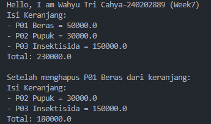
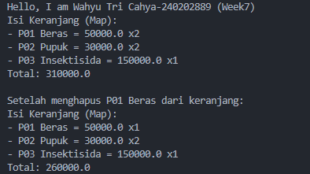

# Laporan Praktikum Minggu 7

Topik: Collections dan Implementasi Keranjang Belanja

## Identitas

* Nama  : Wahyu Tri Cahya
* NIM   : 240202889
* Kelas : 3IKRB

---

## Tujuan

1. Menjelaskan konsep collection dalam Java (List, Map, Set).
2. Menggunakan ArrayList untuk menyimpan dan mengelola objek.
3. Mengimplementasikan Map atau Set sesuai kebutuhan pengelolaan data.
4. Melakukan operasi dasar pada collection: tambah, hapus, dan hitung total.
5. Menganalisis efisiensi penggunaan collection dalam konteks sistem Agri-POS.

---

## Dasar Teori

### 1. Collections Framework

Java Collections Framework menyediakan struktur data untuk mengelola objek secara dinamis dan efisien.

Struktur utama:

- List (implementasi: ArrayList) — Terurut, dapat menyimpan elemen duplikat.
- Map (implementasi: HashMap) — Menyimpan pasangan key–value, akses cepat berdasarkan key.
- Set (implementasi: HashSet) — Tidak menerima duplikat dan tidak mempertahankan urutan.

---

### 2. Studi Kasus: Keranjang Belanja Agri-POS

Keranjang belanja harus dapat:

- Menambahkan produk
- Menghapus produk
- Menampilkan isi keranjang
- Menghitung total nilai transaksi
- Menangani jumlah (quantity) menggunakan Map

Kasus ini mencerminkan penggunaan struktur data dalam aplikasi nyata seperti POS.

---

## Langkah Praktikum

### 1. Membuat Class Product

```java
package com.upb.agripos;

public class Product {
    private final String code;
    private final String name;
    private final double price;

    public Product(String code, String name, double price) {
        this.code = code;
        this.name = name;
        this.price = price;
    }

    public String getCode() { return code; }
    public String getName() { return name; }
    public double getPrice() { return price; }
}
```

## 2. Implementasi Keranjang dengan ArrayList

```java
package com.upb.agripos;

import java.util.ArrayList;

public class ShoppingCart {
    private final ArrayList<Product> items = new ArrayList<>();

    public void addProduct(Product p) { items.add(p); }
    public void removeProduct(Product p) { items.remove(p); }

    public double getTotal() {
        double sum = 0;
        for (Product p : items) {
            sum += p.getPrice();
        }
        return sum;
    }

    public void printCart() {
        System.out.println("Isi Keranjang:");
        for (Product p : items) {
            System.out.println("- " + p.getCode() + " " + p.getName() + " = " + p.getPrice());
        }
        System.out.println("Total: " + getTotal());
    }
}
```

## 3. Main Program (WAJIB DIISI)

```java
package com.upb.agripos;

public class MainCart {
    public static void main(String[] args) {
        System.out.println("Hello, I am [Nama]-[NIM] (Week7)");

        Product p1 = new Product("P01", "Beras", 50000);
        Product p2 = new Product("P02", "Pupuk", 30000);

        ShoppingCart cart = new ShoppingCart();
        cart.addProduct(p1);
        cart.addProduct(p2);
        cart.printCart();

        cart.removeProduct(p1);
        cart.printCart();
    }
}
```

## 4. Implementasi Alternatif Menggunakan Map (Dengan Quantity)

```java
package com.upb.agripos;

import java.util.HashMap;
import java.util.Map;

public class ShoppingCartMap {
    private final Map<Product, Integer> items = new HashMap<>();

    public void addProduct(Product p) { items.put(p, items.getOrDefault(p, 0) + 1); }

    public void removeProduct(Product p) {
        if (!items.containsKey(p)) return;
        int qty = items.get(p);
        if (qty > 1) items.put(p, qty - 1);
        else items.remove(p);
    }

    public double getTotal() {
        double total = 0;
        for (Map.Entry<Product, Integer> entry : items.entrySet()) {
            total += entry.getKey().getPrice() * entry.getValue();
        }
        return total;
    }

    public void printCart() {
        System.out.println("Isi Keranjang (Map):");
        for (Map.Entry<Product, Integer> e : items.entrySet()) {
            System.out.println("- " + e.getKey().getCode() + " " + e.getKey().getName() + " x" + e.getValue());
        }
        System.out.println("Total: " + getTotal());
    }
}
```

---

## Kode Program

### Menggunakan ArrayList
```java
System.out.println("Hello, I am Wahyu Tri Cahya-240202889 (Week7)");

Product p1 = new Product("P01", "Beras", 50000);
Product p2 = new Product("P02", "Pupuk", 30000);
Product p3 = new Product("P03", "Insektisida", 150000);

ShoppingCart cart = new ShoppingCart();
cart.addProduct(p1);
cart.addProduct(p2);
cart.addProduct(p3);
cart.printCart();

System.out.println("\nSetelah menghapus " + p1.getCode() + " " + p1.getName() + " dari keranjang:");
cart.removeProduct(p1);
cart.printCart();
}
```

### Menggunakan Map
```java
System.out.println("Hello, I am Wahyu Tri Cahya-240202889 (Week7)");

Product p1 = new Product("P01", "Beras", 50000);
Product p2 = new Product("P02", "Pupuk", 30000);
Product p3 = new Product("P03", "Insektisida", 150000);

ShoppingCartMap cart = new ShoppingCartMap();
cart.addProduct(p1);
cart.addProduct(p1);
cart.addProduct(p2);
cart.addProduct(p2);
cart.addProduct(p3);
cart.printCart();

System.out.println("\nSetelah menghapus " + p1.getCode() + " " + p1.getName() + " dari keranjang:");

cart.removeProduct(p1);
cart.printCart();
```

---

## Hasil Eksekusi

### Menggunakan ArrayList


### Menggunakan Map


---

## Analisis

Pada praktikum minggu ke-7, konsep **Collections** diterapkan untuk membangun fitur **keranjang belanja** pada sistem Agri-POS.

* **Cara Kerja Program**
  Program menggunakan `ArrayList` untuk menyimpan objek `Product`. Setiap produk dapat ditambahkan atau dihapus dari keranjang, dan total harga dihitung dengan melakukan iterasi terhadap isi collection. Implementasi alternatif menggunakan `HashMap` memungkinkan sistem menyimpan quantity produk sehingga lebih efisien dan realistis untuk aplikasi POS.

* **Perbandingan List dan Map**
  `ArrayList` cocok untuk keranjang sederhana, namun kurang efisien jika produk yang sama ditambahkan berkali-kali. `Map` lebih optimal karena setiap produk disimpan satu kali dengan jumlah tertentu.

* **Kendala dan Solusi**
  Kendala yang ditemui adalah pengelolaan data duplikat pada `ArrayList`. Solusinya adalah menggunakan struktur `Map` agar quantity dapat dikelola dengan lebih baik.

---

## Kesimpulan

Penggunaan **Java Collections Framework** sangat membantu dalam pengelolaan data secara dinamis. Dengan memanfaatkan `ArrayList` dan `HashMap`, sistem keranjang belanja Agri-POS dapat dibuat lebih efisien, terstruktur, dan mudah dikembangkan.

---

## Quiz

1. Jelaskan perbedaan antara **List**, **Map**, dan **Set**.
   **Jawaban:** List menyimpan data terurut dan boleh duplikat, Map menyimpan pasangan key–value, sedangkan Set menyimpan data unik.

2. Mengapa **ArrayList** cocok untuk keranjang belanja sederhana?
   **Jawaban:** Karena mudah digunakan, mendukung data terurut, dan efisien untuk jumlah data kecil.

3. Bagaimana **Set** mencegah duplikasi data?
   **Jawaban:** Set hanya mengizinkan satu elemen unik berdasarkan mekanisme equals dan hashCode.

4. Kapan sebaiknya menggunakan **Map** dibandingkan List? Berikan contoh.
   **Jawaban:** Map digunakan ketika data memiliki pasangan key–value, contohnya produk dengan quantity pada keranjang belanja POS.
