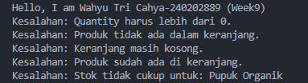

# Laporan Praktikum Minggu 9

Topik: Exception Handling, Custom Exception, dan Design Pattern Sederhana

## Identitas

* Nama  : Wahyu Tri Cahya
* NIM   : 240202889
* Kelas : 3IKRB

---

## Tujuan

Mahasiswa mampu:

1. Menjelaskan perbedaan antara error dan exception.
2. Mengimplementasikan try–catch–finally dengan tepat.
3. Membuat custom exception sesuai kebutuhan program.
4. Mengintegrasikan exception handling ke dalam aplikasi sederhana (kasus keranjang belanja).
5. (Opsional) Menerapkan design pattern sederhana (Singleton/MVC) dan unit testing dasar.

---

## Dasar Teori

1. Error merupakan kesalahan fatal yang umumnya tidak dapat ditangani oleh program.
2. Exception adalah kondisi tidak normal yang masih dapat ditangani menggunakan mekanisme try–catch.
3. Custom exception digunakan untuk merepresentasikan kesalahan bisnis yang spesifik.
4. Blok finally akan selalu dijalankan, baik terjadi exception maupun tidak.
5. Exception handling membantu meningkatkan keandalan dan keamanan aplikasi.

---

## Langkah Praktikum

1. Membuat beberapa class custom exception seperti InvalidQuantityException, ProductNotFoundException, InsufficientStockException, CartEmptyException, dan DuplicateProductException.
2. Mengimplementasikan validasi pada class ShoppingCart menggunakan exception handling.
3. Menguji seluruh custom exception melalui class MainExceptionDemo.
4. Menjalankan program dan mengamati pesan kesalahan yang ditampilkan.
5. Melakukan commit dan push ke repository GitHub dengan pesan:

   `week9-exception: implement custom exception on shopping cart`

---

## Kode Program

Contoh potongan kode pengujian exception pada MainExceptionDemo:

```java
ShoppingCart cart = new ShoppingCart();
Product p1 = new Product("P01", "Pupuk Organik", 25000, 3);

cart.addProduct(p1, -1); // InvalidQuantityException
cart.checkout();         // CartEmptyException
```

---

## Hasil Eksekusi

Berikut adalah hasil eksekusi program setelah semua custom exception diuji:



Output menampilkan pesan kesalahan untuk setiap skenario exception yang terjadi.

---

## Analisis

* Program berjalan dengan memvalidasi setiap operasi pada keranjang belanja.
* Setiap kesalahan bisnis ditangani menggunakan custom exception yang sesuai.
* Dibandingkan minggu sebelumnya, pendekatan ini lebih terstruktur karena kesalahan tidak lagi ditangani secara manual menggunakan if-else.
* Kendala yang dihadapi adalah munculnya error *Unhandled exception*, yang diatasi dengan menambahkan blok catch yang sesuai.

---

## Kesimpulan

Dengan menerapkan exception handling dan custom exception, program menjadi lebih aman, terstruktur, dan mudah dikembangkan. Setiap kesalahan dapat ditangani secara spesifik sesuai kebutuhan bisnis pada sistem POS.

---

## Quiz

1. Jelaskan perbedaan error dan exception.
   **Jawaban:** Error adalah kesalahan fatal yang tidak dapat ditangani, sedangkan exception adalah kesalahan yang masih bisa ditangani oleh program.

2. Apa fungsi finally dalam blok try–catch–finally?
   **Jawaban:** Finally digunakan untuk menjalankan kode yang harus selalu dieksekusi, baik terjadi exception maupun tidak.

3. Mengapa custom exception diperlukan?
   **Jawaban:** Custom exception diperlukan untuk merepresentasikan kesalahan bisnis secara spesifik agar kode lebih jelas dan terstruktur.

4. Berikan contoh kasus bisnis POS yang membutuhkan custom exception.
   **Jawaban:** Contohnya adalah ketika stok produk tidak mencukupi saat checkout, sehingga diperlukan InsufficientStockException.
